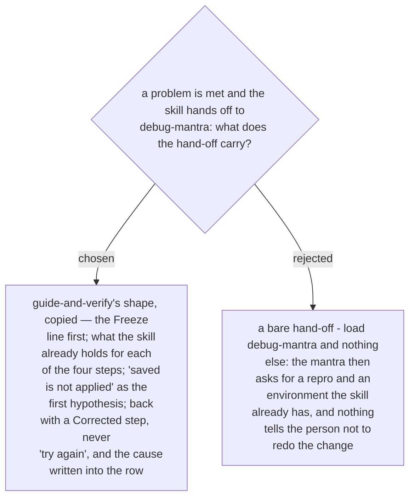

# The hand-off to debug-mantra opens with a Freeze line and returns with a Corrected step

Confirmed by the owner in the recap of 2026-10-03, as the fifth of five defaults; it
closes what ADR 0232 left open. The text lives in the new skill alone (ADR 0231), and
`debug-mantra` is not edited (ADR 0216).

When a problem is met (ADR 0244) the person first reads the Freeze line — expected, got,
and do not redo the change or alter anything. Then `debug-mantra` is loaded and followed
as written, and the skill already holds:

| debug-mantra step | the skill already has |
|---|---|
| ① reproduce | the row's test and its recorded results — the failing test is the repro; the environment is the one the document names |
| ② fail path | the layers between the two ends of the connection — name resolution, route, each firewall, the host's own firewall, the listener, TLS, the account and its permission — and the numbered lines of the change just made |
| ③ falsify | hypothesis #1 is always *saved is not applied*: the rule is approved but not active, the software is installed but the service was not restarted |
| ④ breadcrumbs | the results already written in the rows, each with its date |

A second problem in the same run sends the Freeze line again and re-enters at step ①
with the same ledger and no second recital. A confirmed cause comes back as a Corrected
step in the fixed shape, asserted against the failed measurement, and the cause and both
times are written into the row.
