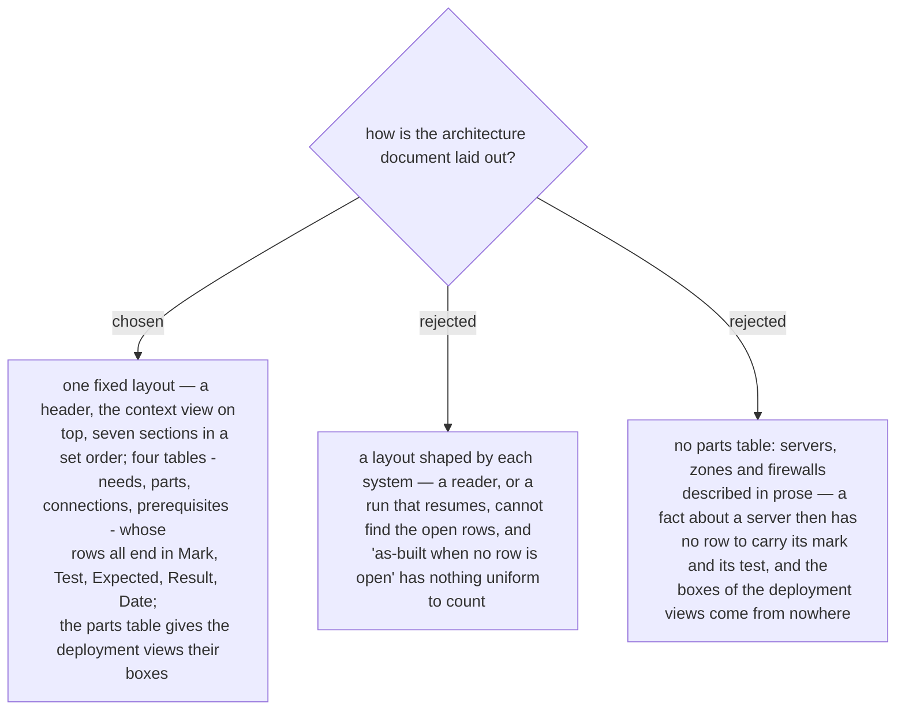

# The architecture document has one fixed layout — a parts table, and the same five columns on every row
> **Refined by ADR 0258 (2026-10-03):** a zone is a label on a part, not a row of the parts table, and a part with no fact a command can read carries dashes in the five columns and is never counted as open.

First stated in the design spec of 2026-10-03 (§5) and approved with it by the owner the
same day. The earlier decisions each added a table or a rule — a mark on every fact
(ADR 0233), a row as the source (ADRs 0237, 0247), results in the row (ADR 0242) — and
this one fixes how they sit together.

The header carries the system, the environment, the status, the boundary sentence and
the date of the last change to a row. The context view is the document's overview
diagram. Then: the new system, needs, the old system as-is, the new architecture,
prerequisites, changes, and what was not measured or is owed. Every row of the four
tables ends with the same five columns, so one rule covers them all: a row is open until
its mark is measured and its result equals its expected result. The parts table (`S-01`)
holds one row per server, database, firewall, zone or user device the needs touch.
