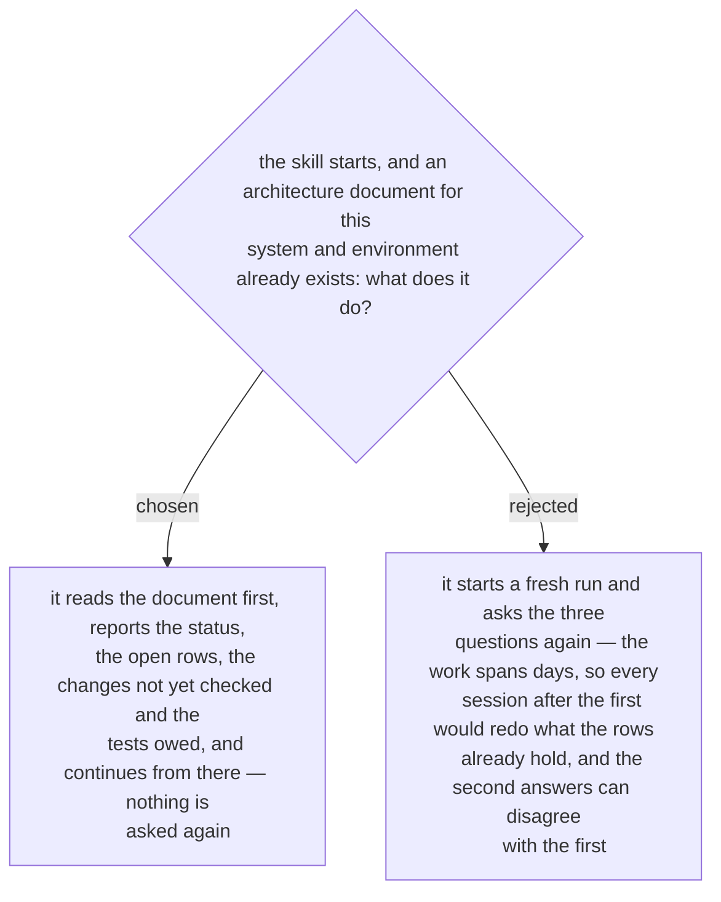

# A run that finds its document resumes from it

First stated in the design spec of 2026-10-03 (§4, Phase 0) and approved with it by the
owner the same day. A firewall request takes days, and a test of a connection into the
new system is owed until that system is installed (ADR 0248), so a run is rarely one
session.

The document is the memory. A fact is written into its row when it is taken, which is
why the file is created in the first phase and not at the end; a later session reads the
file, shows what is open, and goes on from the first open row. The results it adds go
into the same rows (ADR 0242).
