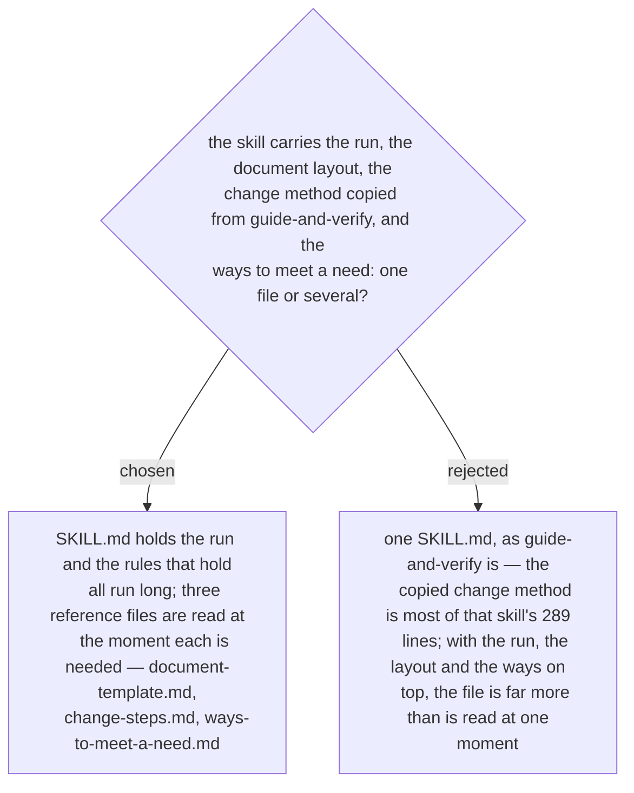

# architect-and-verify is one SKILL.md and three reference files

First stated in the design spec of 2026-10-03 (§3) and approved with it by the owner the
same day. `SKILL.md` names the moment each reference is read: the document template
before the document is created, the ways when the first need needs one, the change steps
before the first change is guided or the first test fails.

The references are the skill's own files, named by skill-relative path. `change-steps.md`
is where the copy from `guide-and-verify` lives (ADR 0231), with one provenance line at
its top and nothing that tells a reader to load the original.
