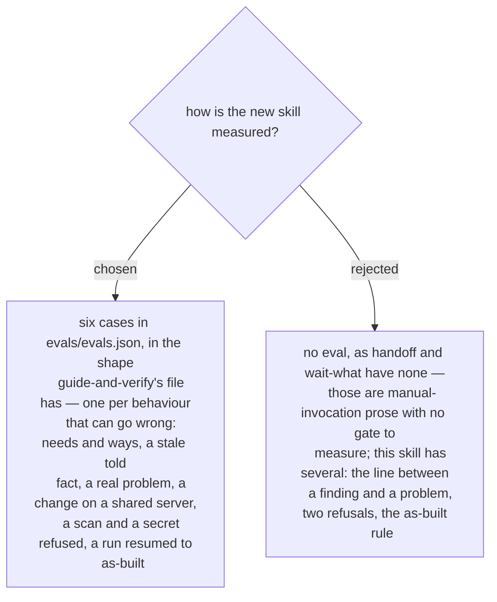

# architect-and-verify is measured by six eval cases
> **Refined by ADR 0260 (2026-10-03):** case 0 measures "the three questions first" as order — the three answers its message gives are written first and are not asked again; no one-turn case measures the question round itself.

First stated in the design spec of 2026-10-03 (§9) and approved with it by the owner the
same day. The six cases and what each must show:

- `new-portal-needs-old-user-data` — the three questions first, a needs row, told
  against measured, ways proposed and the choice left to the user, one ID on the row,
  the arrow and the test.
- `stale-diagram-is-a-finding` — a told fact contradicted by a measurement becomes a
  measured fact and a change; no hand-off to `debug-mantra`.
- `rule-open-but-test-fails` — the Freeze line, then `debug-mantra`, with *saved is not
  applied* first.
- `sdk-on-a-shared-server` — all eight steps, with the before-state and what must not
  change.
- `scan-and-secret-refused` — no scan, and no password in the document.
- `resume-to-as-built` — the document is read first; as-built only when no row is open.
