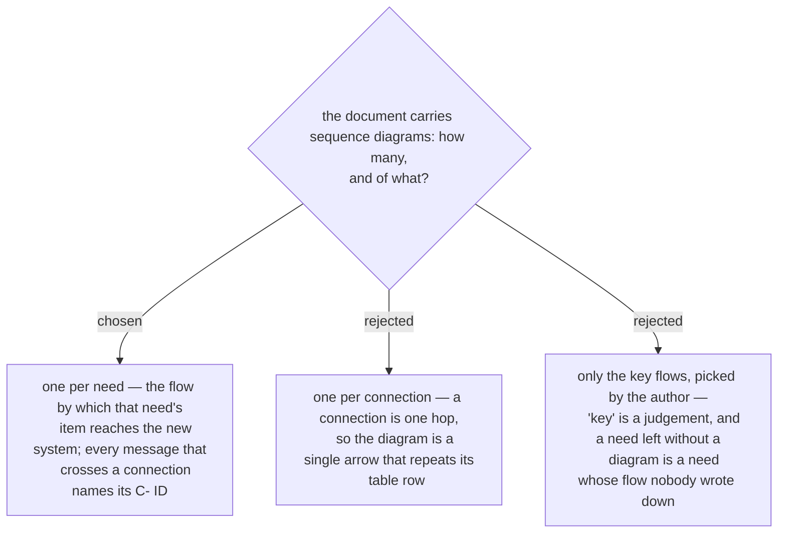

# The architecture document has one sequence diagram per need

First stated in the design spec of 2026-10-03 (§5) and approved with it by the owner the
same day. ADR 0236 put a sequence diagram among the five views and described it as one
flow across the connections; this fixes which flows.

A need is the unit that has a flow: the new system asks, the request crosses one or more
connections, and the item comes back. So each need gets one diagram, its participants
are the parts on that need's connections, and a message that crosses a connection carries
the connection's ID — the same ID as the table row, the arrow and the test (ADR 0237).
