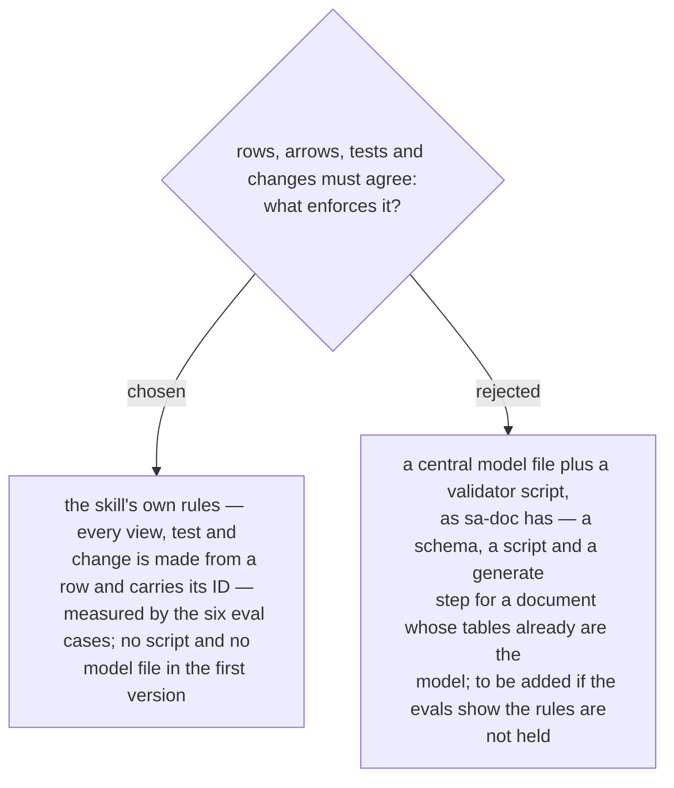

# No validator script in the first version — the rows are the source, and the evals measure it

First stated in the design spec of 2026-10-03 (§2, the *Out* list) and approved with it
by the owner the same day. `sa-doc` generates its document from `sa-model.yaml` behind a
validator, because a hand-written document of that size contradicts itself (ADR 0025).

This document is smaller and its tables are its model: a connection is a row, and the
arrow and the test are made from the row (ADRs 0237, 0247). The first version relies on
that rule being followed and measures it with the evals (ADR 0255). The spec records the
risk as assumed, not verified: prose rules alone may not hold on a large document, and a
checker is the next step if they do not.
