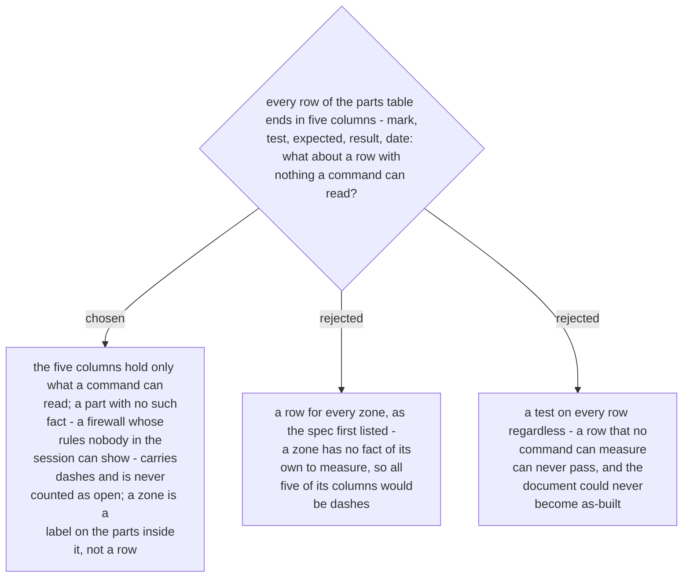

# The five columns are for facts a command can read — a zone is a label, and a part with no such fact carries dashes

Ruled at planning, 2026-10-03, while the document template was written out in full;
reported to the owner with the plan. ADR 0252 gave every row of the four tables the same
five columns and listed a zone among the kinds of part. Written out as a real document,
two rows had nothing to put in those columns: a zone, which is a name for a group of
parts, and a firewall whose rules nobody in the session can read.

So the five columns hold only what a command can read. A part with no such fact has `—`
in all five and is never counted as open; its effect is tested by the connection rows
that cross it. A zone is the Zone column of the parts inside it, and the deployment
views group parts by that column. This does not loosen ADR 0242: a row that has a fact
and cannot be measured still keeps the document to-be — there is no "as-built with
exceptions".
