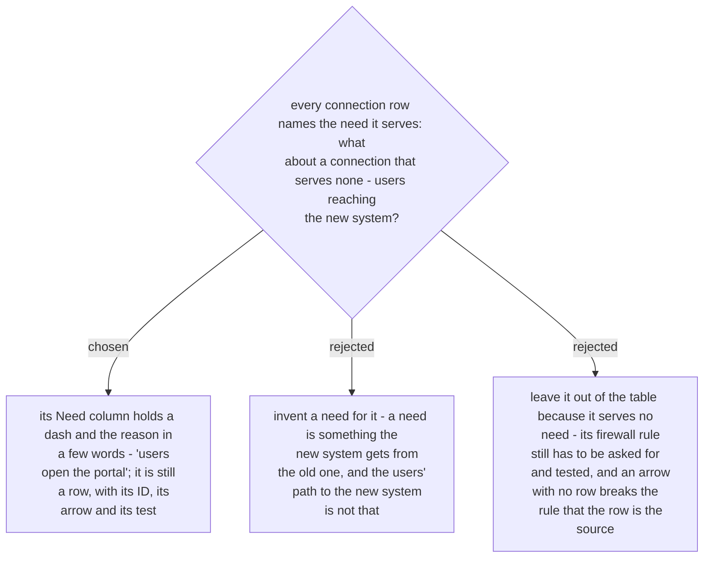

# A connection that serves no need of the old system names its reason instead

Ruled at planning, 2026-10-03, while the worked example of the document was written;
reported to the owner with the plan. ADR 0239 says every connection row names the need
it serves. The example needed a third connection — from the staff's PCs to the new
portal — and no need stands behind it: nothing is taken from the old system.

The sample the owner chose from for ADR 0237 already carried such a row ("users open the
web application"), so the row stays. Its Need column holds `—` and the reason in a few
words, and everything else about it is as for any other connection: an ID, one arrow in
the deployment view to-be, one test.
