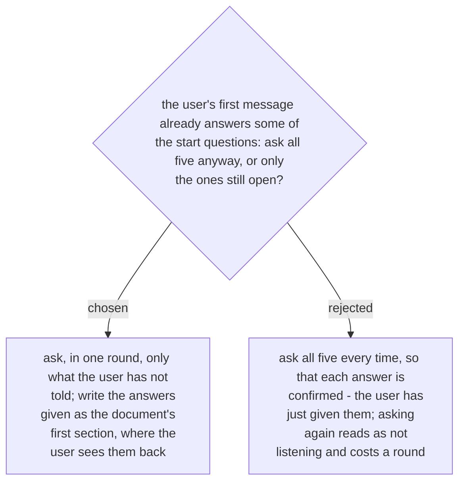

# A start question the user has already answered is not asked again

Spec §4 says Phase 1 asks, in one round, the environment, where to save the document and
the three questions of ADR 0238. When the plan wrote `SKILL.md` out in full, it read that
as "ask only what the user has not already told you", and did not record the choice. The
review of the eval cases found the gap on 2026-10-03, during execution.

A user who opens with the environment, the path, and what the new system is, runs on and
needs has already answered the round. The skill writes those answers as the document's
first section and goes on; the user sees them there and corrects any that were misread.
Only a question left unanswered is asked, and all such questions are asked together, in
one round. ADR 0238's order is unchanged: the answers about the new system come first,
and the examination of the old system covers only what they point at.

Eval case 0 (`new-portal-needs-old-user-data`, ADR 0255) measures this decision. Its
message answers all five questions: the skill must not ask again, and must write the three
answers as the document's first section, before the needs and before anything about the
old system. No case measures the round itself, for a message that answers nothing: a
one-turn case that asks cannot also show the needs, the ways and the IDs that case 0
exists to measure.
