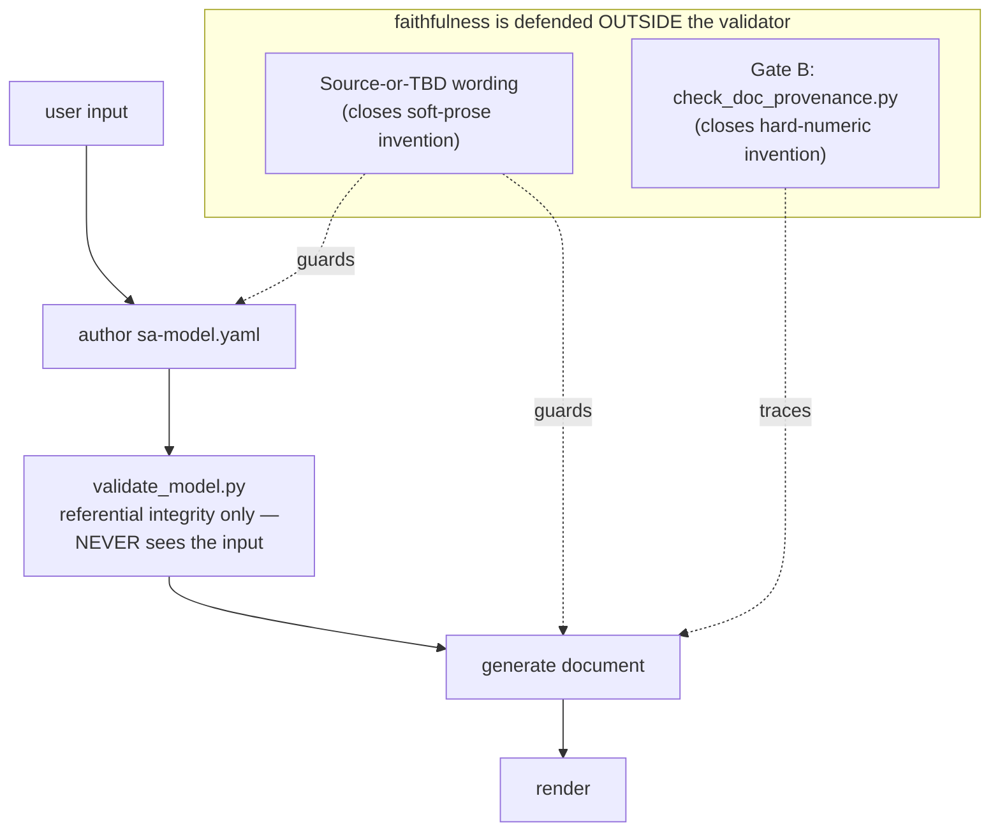

# Advisory — making sa-doc 100% source-faithful

**Date:** 2026-07-06 · **Method:** Study → Design → Verify (5 readers → 3 designers → 1 adversarial reviewer)
**Question:** Where can sa-doc introduce facts absent from the user's input, and how do we guarantee the generated document is 100% faithful to the source (TBD the only allowed placeholder)?

The audit's decisive finding: **`validate_model.py` receives only the model, never the source input** — so it can prove the model is internally consistent but can *never* prove a value came from the input. Every anti-fabrication guard therefore lives in wording, not in the gate. Worse, three validator rules actively *push* invention.

## The 5 problems worth fixing, ranked by pain

1. **A fabricated-but-consistent value ships silently.** An invented price, NFR metric, field size, security mechanism, or citation that is internally consistent passes every validator rule. This is the whole risk — a document that *looks* authoritative but isn't faithful. *(Consequence: the exact failure a faithful SA doc must not have.)*
2. **Validator warnings/gates reward invention.** W9 (empty metric), W8 (no primary key), E8 (professional ⇒ non-empty security) nag the author to fill a blank; the cheapest way to clear the nag is a plausible invented value, not `TBD`. The tool fights its own faithfulness goal.
3. **Source-less template fields solicit invention.** Field 5 *Stakeholders & **interests*** ("derived from scope rows" — but the schema has no *interests* field), professional *Security design* ("must state how credentials are stored (hashing)"), *Deployment view* ("expanded to environments"), academic *literature relevance* and *budget total* — each asks for content with no model source and no `—/TBD` fallback.
4. **The invariant was weak and self-contradictory.** "`TBD` is a legal value for any leaf" (contradicted by E9); "never invent" named only "actors, fields, prices, rules" (licensing everything unnamed); and the author was told `TBD` is *acceptable*, never *preferred over a guess*.
5. **Nothing mechanically checks that the document introduces no fact beyond the model** — "prose connects, never introduces" was pure hope.

## Phase 1 — Source-or-TBD wording (implemented, zero regression)

- **Front-loaded one inviolable invariant** in `SKILL.md`: every value traces to the input or is `TBD`; the validator can't enforce it, so the rule does; guessing is a defect.
- **Broadened "never invent"** to every fact class (numbers, metrics, sizes, samples, cardinalities, dates, states/triggers, architecture, security controls, budget, citations, interests).
- **Cloned Field 12's triple-guard** (source-pointer / else "—" / never-invent) onto Fields 2, 3, 5, 11, 13 and the professional (security/deployment/test-seed) and academic (literature/budget/bibliography) sections.
- **Fixed the contract contradiction** ("legal for every leaf *except* meta…"), added per-leaf reminders on the tempting source-less leaves, and added a **pre-write provenance self-check** with a class-vs-instance nuance (so it isn't a literal word-ban).

## Phase 2 — Gate B, the mechanical backstop (implemented)

`scripts/check_doc_provenance.py <doc.md> <sa-model.yaml> [--source …] [--strict]` traces every **hard numeric fact** in the generated document back to a model value — the only mechanical enforcement of "prose connects, never introduces." Report mode by default (resolve each finding like a warning); `--strict` blocks. Structural numbers (headings, list markers, id suffixes like `FR-1`/`TC-UC-ORDER-1`, table index/step cells) are exempt; code/mermaid fences skipped. Intake now persists raw input to `SA-<project>/.source/`. Verified against the bookstore fixture: a faithful doc → 0 findings; an injected `99.9% uptime`/`45000 บาท` → both flagged, nothing structural.

## What NOT to do, and why

- **Do NOT add a per-leaf `src` schema field enforced by the validator (Design 1).** The `src` is written by the same LLM that could fabricate the value — self-attested, not enforcement. It also silently breaks the clean fixture and the in-code `base_model()` the test suite depends on, and roughly doubles authoring effort. Rejected; only its `TBD`-contradiction fix was adopted.
- **Do NOT make Gate B a hard blocker by default.** Numeric token-tracing across bilingual prose has real false-positive surface; a brittle default block would halt clean documents. Report-by-default with `--strict` opt-in keeps the signal without the brittleness.
- **Do NOT rely on `validate_model.py` for faithfulness.** It structurally cannot compare a value to the source; adding warnings there only increases fabrication pressure (problem 2).
- **Do NOT implement the self-check as a literal hedge-word ban.** "standard", "typically" etc. appear in legitimate sourced values — the target is invented *content* (class-vs-instance), not the words.

## Phase 3 — optional, deferred (severable; Phases 1–2 do not depend on it)

Source-aware verification: with `.source/` intake now persisted, a later gate can confirm each quoted value actually occurs in the input (Design 1's E13), and Gate B can extend from bare numbers to currency/date proximity. Defer until the `.source/` intake path is proven in real runs.

## Why this shape and not the alternatives

- **Design 1 (Provenance-First, per-leaf `src`)** promised the strongest guarantee but delivered self-attestation, broke the test suite, and doubled effort — high cost, gameable payoff.
- **Design 3 (Gate-enforced) alone** left every soft-prose leak (interests, invented mechanisms) untouched, since token gates only see hard tokens.
- **Design 2 (Source-or-TBD wording) alone** closed every *verified* leak at zero risk but added no mechanical guarantee. The winning shape is **Design 2 as the baseline + Design 3's Gate B on top** — wording for the soft class, a numeric gate for the hard class, neither depending on the blind validator.

## Appendix — exact changes, gotchas, evidence

- **Files changed:** `SKILL.md` (invariant, broadened list, self-check, Step 4.5, intake persistence), `references/model-contract.md` (contradiction fix, per-leaf reminders), `references/template-core.md` (Fields 2/3/5/11/13 + global guard), `references/template-professional.md` (security/deployment/test-seed), `references/template-academic.md` (literature/budget/bibliography). **New:** `scripts/check_doc_provenance.py` + `scripts/test_check_doc_provenance.py`.
- **Gate B invocation:** `python scripts/check_doc_provenance.py SA-<project>/SA-<project>.md SA-<project>/sa-model.yaml --source SA-<project>/.source/input.txt`
- **Gotcha (fixed):** printing Thai to a Windows cp1252 console crashes; `validate_model.py`, `render_doc.py`, and `check_doc_provenance.py` now force UTF-8 stdout.
- **Tests:** validator 47/47, renderer 13/13, Gate B 9/9; bookstore fixture validates 0/0/0.
- **Decision record:** ADR 0027 (`docs/adr/0027-sa-doc-enforces-source-faithfulness.md`).
- **Evidence folder:** the fabrication-audit workflow transcript (5 readers, 3 designs, 1 adversarial verifier) under this session's workflow transcript dir.
