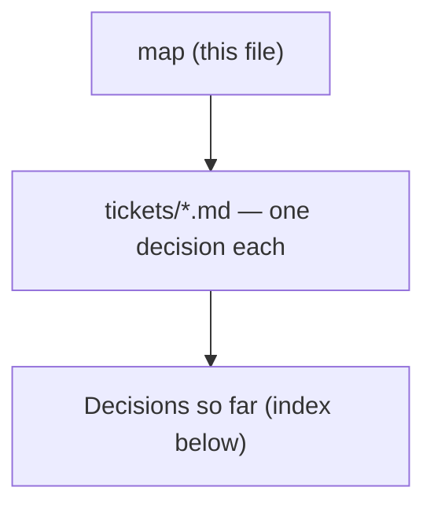

# Decision map - route every superpowers review step to scrutinize

## Destination
The superpowers skills that carry a review step are copied into this repo, with all seven review touchpoints routed to the existing scrutinize skill, running in both Claude Code and Antigravity, and with a documented path to resync the copies from upstream.

## Notes
Constraints fixed at chart time: scrutinize is FROZEN - the copies adapt to it as-is, its behaviour and output format do not change. Upstream is obra/superpowers, MIT (c) 2025 Jesse Vincent, vendored from sha b36e0829c6d0 (byte-identical to the 6.3.0 cache dir); the live plugin is a url-source clone, so editing the plugin cache is never the mechanism. Closure is ~2100 lines over six skill dirs plus subagent-driven-development/scripts/review-package, because touchpoints #1 (spec) and #2 (plan) live inside brainstorming and writing-plans rather than in standalone review skills. Distribution scope is this repo plus Antigravity only. Repo conventions apply to whatever ships: one PLAYBOOK.md row per skill, the diagram convention, versions and ADR numbers minted from the global max. Grilling tickets: load sp-grill-with-doc. The seven touchpoints: 1 brainstorming/spec-document-reviewer-prompt.md, 2 writing-plans/plan-document-reviewer-prompt.md, 3 requesting-code-review (SKILL.md + code-reviewer.md), 4 subagent-driven-development/task-reviewer-prompt.md, 5 subagent-driven-development/re-review-prompt.md, 6 receiving-code-review/SKILL.md, 7 executing-plans/SKILL.md.

## Decisions so far

<!-- decision-map:decisions:start -->
- [Ripple - which existing daily-arc handoffs get repointed at the copies?](tickets/arc-rewiring.md) — All 11 refs - one skill, 4 files - become short-form sp-writing-plans; grill-then-plan Step 0 retargets to it; PLAYBOOK and the daily router need no change, they never named superpowers.
- [Mechanism - with per-skill disable impossible, does the plugin go fully off or stay fully on?](tickets/coexistence-mechanism.md) — Plugin stays FULLY on; this marketplace ships its OWN SessionStart hook that re-points the one skill the upstream hook names - measured 3/3 against a 2/2 control, not assumed.
- [Coexistence - does the superpowers plugin stay enabled alongside the copies?](tickets/coexistence.md) — Plugin stays enabled; the six review-carrying originals go off via skillOverrides - the other eight skills stay live and the copies' outbound refs keep resolving.
- [Harness behaviour - how does Claude Code resolve two skills with the same name from different plugins?](tickets/harness-skill-shadowing.md) — Both load - no collision, since plugin skills are namespaced plugin:skill; skillOverrides switches off one skill without disabling its plugin.
- [Host plugin - do the copies live in dev-workflows or a new plugin of their own?](tickets/host-plugin.md) — The six copies live in plugins/dev-workflows - no sixth plugin: the destination needs Antigravity and its only installer is plugin-local, and ADR 0070's hook must ship beside them.
- [Naming - what are the copied skills called, and what do their descriptions trigger on?](tickets/skill-naming.md) — The six copies take the sp- prefix, reference each other by short name (the eight non-copied stay superpowers:*), and each description names the upstream skill it displaces.
- [Live check - does a plugin-qualified skillOverrides key work, and what does the hook do when its skill is off?](tickets/skilloverrides-live-check.md) — Observed on CC 2.1.232: skillOverrides cannot reach a PLUGIN skill by EITHER key form - only whole-plugin disable works, and the hook injects a file so no override touches it.
<!-- decision-map:decisions:end -->

## Not yet specified

<!-- decision-map:fog:start -->
- Whether receiving-code-review (#6) still has a job once reviews come from scrutinize - it teaches how to TAKE feedback, not how to produce it, so it may need nothing, a light edit, or no copy at all.
- How the swap gets verified end-to-end - what acceptance check proves a real superpowers-style run actually reached scrutinize instead of the built-in reviewer.
- Whether subagent-driven-development/scripts/review-package needs to change, and what it assumes about the reviewer it packages for.
- Whether Claude Code's /skills picker will show an override on a plugin skill as applied while enforcement ignores it - the listing UI computes the override without the plugin exemption the enforcement resolver applies, which would make any future per-skill claim about a plugin untrustworthy unless it is checked live.
- Whether the commit-log PostToolUse hook (ADR 0054) is being retired - the working tree has emptied plugins/dev-workflows/hooks/hooks.json, which is the same file ADR 0073 puts ADR 0070's SessionStart hook in.
<!-- decision-map:fog:end -->

## Out of scope

<!-- decision-map:scope:start -->
- Syncing the vendored skill copies tracked under menunest's .agents/ directory.
- The dev-playbook distribution at ~/Downloads/custom-skill - the active PAT cannot push to it.
- The separate superpowers copies under .gemini/extensions and .codex/plugins.
- Changing scrutinize's own behaviour, stance or output format - it is frozen by decision.
- Contributing any of this back upstream to obra/superpowers.
- Copying or replacing the eight superpowers skills that carry no review step - the coexistence decision keeps them live from the upstream plugin, and two of them (using-git-worktrees, finishing-a-development-branch) are load-bearing for the copies.
- Repointing references to superpowers skills that carry NO review touchpoint - problem-description's systematic-debugging pointer is an editorial call about this repo's own debug-mantra, not part of the review-to-scrutinize swap (ADR 0072).
<!-- decision-map:scope:end -->
