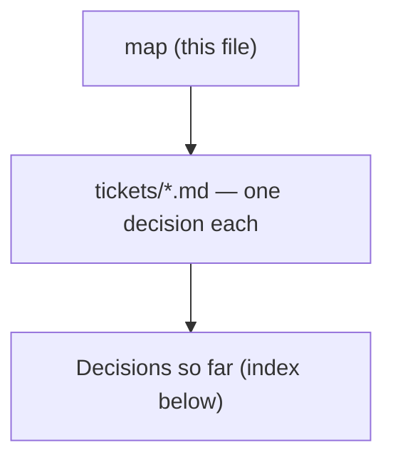

# Decision map - route every superpowers review step to scrutinize

## Destination
The superpowers skills that carry a review step are copied into this repo, with every REAL reviewer dispatch - four of them, driven by three prompt files - routed to scrutinize-dispatch, a dispatch-tuned copy of the frozen scrutinize that states one scope and emits the controller's own severity words (ADR 0084, superseding ADR 0076); the four remaining charted touchpoints are two dead files and two steps that dispatch nothing, so nothing is routed at them (ADR 0074), and the skills holding them are copied for chain integrity instead; all of it running in both Claude Code and Antigravity, with a documented path to resync the copies from upstream.

## Notes
Constraints fixed at chart time: scrutinize is FROZEN - the copies adapt to it as-is, its behaviour and output format do not change. Upstream is obra/superpowers, MIT (c) 2025 Jesse Vincent, vendored from sha b36e0829c6d0 (byte-identical to the 6.3.0 cache dir); the live plugin is a url-source clone, so editing the plugin cache is never the mechanism. Closure is 21 files - 2407 Markdown lines plus 1559 non-Markdown - copied verbatim over six skill dirs, then one rewrite pass (ADR 0074). CORRECTED 2026-08-14: only FOUR reviewer dispatches exist, driven by THREE prompt files inside requesting-code-review and subagent-driven-development; touchpoints #1 and #2 name files nothing references (the live step is an inline self-review checklist), #6 dispatches nothing, and #7 has the agent review the plan itself. The other four skills are copied for their qualified handoffs, not for a review step of their own. Distribution scope is this repo plus Antigravity only. Repo conventions apply to whatever ships: one PLAYBOOK.md row per skill, the diagram convention, versions and ADR numbers minted from the global max. NARROWED 2026-08-14 (ADR 0077): the diagram convention does NOT reach the six vendored copies or the documents they generate - it still binds this repo's own skills, ADRs and ticket resolutions; the three WIRING conventions (plugin-root path, frontmatter, harness-neutral wording) do bind, at zero new resync cost, and each copy gets a PLAYBOOK row in one new grouped section. Grilling tickets: load sp-grill-with-doc. The seven charted touchpoints, with what each was measured to be (ADR 0074): 1 brainstorming/spec-document-reviewer-prompt.md (DEAD FILE), 2 writing-plans/plan-document-reviewer-prompt.md (DEAD FILE), 3 requesting-code-review (SKILL.md + code-reviewer.md), 4 subagent-driven-development/task-reviewer-prompt.md, 5 subagent-driven-development/re-review-prompt.md, 6 receiving-code-review/SKILL.md, 7 executing-plans/SKILL.md. CONSTRAINT ADDED 2026-08-14 by the owner: scrutinize is NEVER edited - if a change to it is genuinely required, the change goes into a NEW Skill that is a copy of it, and taking that option changes the destination line rather than resolving a ticket under it (ADR 0076). ESCAPE HATCH TAKEN 2026-08-15, by the owner, after a scrutinize review of this map: the frozen scrutinize says 'the diff is the entry point, not the scope' while the harness prompt it would run inside says 'do not crawl the broader codebase', and ADR 0076 stated no precedence - so whichever won, half the design was silently defeated. The three prompts now name scrutinize-dispatch instead, which removes the contradiction and the severity-translation layer together; the destination line changed accordingly (ADR 0084).

## Decisions so far

<!-- decision-map:decisions:start -->
- [Antigravity - does install-antigravity.py cover the copies, or need a new rewrite shape?](tickets/antigravity-install.md) — No installer change needed - the 21 files at b36e082 contain ZERO CLAUDE_PLUGIN_ROOT, so rewrite_plugin_root has nothing new to learn; three residual Antigravity facts recorded.
- [Ripple - which existing daily-arc handoffs get repointed at the copies?](tickets/arc-rewiring.md) — All 11 refs - one skill, 4 files - become short-form sp-writing-plans; grill-then-plan Step 0 retargets to it; PLAYBOOK and the daily router need no change, they never named superpowers.
- [Attribution - how is the MIT notice carried on vendored files?](tickets/attribution.md) — Upstream MIT ships verbatim in dev-workflows/LICENSE-superpowers with the sha and a MODIFIED marker, never per-file; the repo also gained the top-level LICENSE it never had.
- [Mechanism - with per-skill disable impossible, does the plugin go fully off or stay fully on?](tickets/coexistence-mechanism.md) — Plugin stays FULLY on; this marketplace ships its OWN SessionStart hook that re-points the one skill the upstream hook names - measured 3/3 against a 2/2 control, not assumed.
- [Coexistence - does the superpowers plugin stay enabled alongside the copies?](tickets/coexistence.md) — Plugin stays enabled; the six review-carrying originals go off via skillOverrides - the other eight skills stay live and the copies' outbound refs keep resolving.
- [Conventions - how far must vendored copies obey this repo's skill conventions?](tickets/convention-compliance.md) — Three wiring conventions bind at zero new cost - already ADR 0074 edits, or already satisfied; the Mermaid rule does not reach the copies' output; PLAYBOOK gains six rows.
- [Granularity - whole skill directories, or just the reviewer prompt files with shims?](tickets/copy-granularity.md) — All 21 files copied verbatim plus one rewrite pass; shims are impossible - a reviewer prompt is a RELATIVE link inside the SKILL.md, so only a copied SKILL.md can redirect a dispatch.
- [Harness behaviour - how does Claude Code resolve two skills with the same name from different plugins?](tickets/harness-skill-shadowing.md) — Both load - no collision, since plugin skills are namespaced plugin:skill; skillOverrides switches off one skill without disabling its plugin.
- [Host plugin - do the copies live in dev-workflows or a new plugin of their own?](tickets/host-plugin.md) — The six copies live in plugins/dev-workflows - no sixth plugin: the destination needs Antigravity and its only installer is plugin-local, and ADR 0070's hook must ship beside them.
- [Distribution - what makes sure a colleague has superpowers installed before the copies need it?](tickets/override-distribution.md) — Re-scoped off the void skillOverrides premise: four manual steps cannot be shipped, and a read-only dev-workflows setup-check reports all four - the ado-backlog/github-backlog pattern.
- [receiving-code-review - it dispatches nothing, so what does the copy actually change?](tickets/receiving-code-review-role.md) — Copied verbatim - the set stays six, justified by set completeness and the 1:1 upstream mapping, not a review step; ADR 0076 leaves nothing to retune, class 4 absorbs the unmeasured ref fact.
- [Resync - what is the documented procedure for pulling upstream changes into the copies?](tickets/resync-path.md) — Resync is a checker script that reports and changes nothing, driven by ONE recorded sha plus a 21-file manifest; a person applies the 9 files edits and the exit code says done.
- [Acceptance check - what observable signal proves a dispatched review actually ran scrutinize?](tickets/review-acceptance-check.md) — The proof is the subagent's own Skill tool_use naming dev-workflows:scrutinize - harness-written so unfakeable; toolStats cannot see it and it never persists, so the check is a run not a gate.
- [Invocation - how does a dispatched reviewer subagent run a frozen, human-facing scrutinize?](tickets/reviewer-invocation.md) — SUPERSEDED by ADR 0084 - harness and frozen scrutinize contradicted each other on scope, so the prompts now name scrutinize-dispatch, a tuned copy; no translation layer.
- [Live check - does a bare sp- reference actually resolve to the plugin skill, on both harnesses?](tickets/short-ref-resolution.md) — Short form DOES resolve - the model self-qualifies to dev-workflows:sp-*; but with the copy ABSENT it silently launches the upstream twin instead of failing. Subagents DO inherit effort: max.
- [Naming - what are the copied skills called, and what do their descriptions trigger on?](tickets/skill-naming.md) — The six copies take the sp- prefix, reference each other by short name (the eight non-copied stay superpowers:*), and each description names the upstream skill it displaces.
- [Live check - does a plugin-qualified skillOverrides key work, and what does the hook do when its skill is off?](tickets/skilloverrides-live-check.md) — Observed on CC 2.1.232: skillOverrides cannot reach a PLUGIN skill by EITHER key form - only whole-plugin disable works, and the hook injects a file so no override touches it.
- [Preflight - does grill-then-plan's Step 0 gate still have a job now that both skills ship in one plugin?](tickets/step0-preflight-fate.md) — Step 0 stays but stops blocking - it becomes a one-line warning about the UPSTREAM plugin, the only thing that can still be absent; the gate ADR 0072 kept passes by construction.
- [User commands - do /brainstorm, /write-plan and /execute-plan get repointed at the copies?](tickets/user-command-entry.md) — The three commands move into plugins/dev-workflows/commands/ naming short-form sp- targets; deleting the personal originals is part of the decision, since an exact name beats autocomplete.
<!-- decision-map:decisions:end -->

## Not yet specified

<!-- decision-map:fog:start -->
- Whether subagent-driven-development/scripts/review-package needs to change, and what it assumes about the reviewer it packages for.
- WHY the commit-log PostToolUse hook was retired - correcting this line, which said 'the working tree has emptied' hooks.json and so reads as an uncommitted edit someone can still see: it was committed empty in e7839a8, git status is clean, and it has landed. The only stated reason is 'no longer needed' and no ADR records it. ADR 0054 now carries a Retired banner, commit-log.py (5.6 KB) is still in the tree referenced by nothing, and this is the same file ADR 0073 puts ADR 0070's SessionStart hook in - so the file the vendoring design depends on is currently empty.
- Nothing notices that upstream moved - ADR 0075 makes resync on-demand with no trigger, and this repo has no CI to hold one, so a new superpowers version can sit unpulled indefinitely.
- Nothing notices a routing failure during ordinary use - ADR 0079 measured that the dispatched subagent's Skill record never reaches the session log, so a review that quietly ran the built-in reviewer leaves no trace anyone can find afterwards, and the only proof is a probe arranged in advance.
- Whether a routed review's Critical finding actually fires the controller's fix loop at subagent-driven-development/SKILL.md:356 - ADR 0084 deletes the translation layer, so scrutinize-dispatch emits Critical natively and ADR 0075's checker now asserts a reference that either resolves or does not, rather than three severity rows a future editor might drop. But ADR 0079's probe still stops at the reviewer LOADING the skill, so nothing yet watches the gate itself fire.
- Nothing checks the upstream dependency at the point of USE - ADR 0080 warns at the START of a design session and ADR 0082's setup-check reports it on demand, both several hops before sp-executing-plans reaches superpowers:finishing-a-development-branch, so a user who reads past the warning and never runs the check hits a missing skill with no further notice.
- Nothing in the marketplace can REMOVE a personal command a colleague already wrote - ADR 0082's setup-check now reports one as a FAIL, so it is no longer undetectable, but the deletion itself stays manual on every machine that has one and nothing makes anyone run the check.
- install-antigravity.py rewrites and leak-checks MARKDOWN ONLY (dest.rglob('*.md') at line 135) while the copies bring 8 non-Markdown files (1559 lines) - and correcting the 'harmless at b36e082' reading of this line: a plugin-root dependency ALREADY exists in one of them, just not spelled ${CLAUDE_PLUGIN_ROOT}. brainstorming/scripts/server.cjs:209 walks path.join(__dirname, '../../..') and reads the plugin's package.json for a version; under plugins/dev-workflows that resolves to a directory with no package.json, so the companion silently reports version 'unknown'. Benign in itself - the point is that the rewrite pass and the leak detector are BOTH blind to this file class, so the next upstream change here stages unrewritten and unwarned.
- What ADR 0074's rewrite pass does with '../using-superpowers/references/' at executing-plans/SKILL.md:14 - it names one of the EIGHT non-copied skills, and nothing stages a using-superpowers directory into Antigravity's flat skills dir, so the path dangles there whatever Claude Code does with it.
- Nothing compares scrutinize-dispatch against scrutinize once the latter is improved - ADR 0084 makes the copy a DECLARED fork with a four-point delta, which is visible where three embedded duplicates would not have been, but no check re-reads the two side by side. This is the drift risk ADR 0076 rejected its option C for, reduced from three copies to one and moved into the open, not eliminated.
<!-- decision-map:fog:end -->

## Out of scope

<!-- decision-map:scope:start -->
- Syncing the vendored skill copies tracked under menunest's .agents/ directory.
- The dev-playbook distribution at ~/Downloads/custom-skill - the active PAT cannot push to it.
- The separate superpowers copies under .gemini/extensions and .codex/plugins.
- Changing scrutinize's own behaviour, stance or output format - it is frozen by decision.
- Contributing any of this back upstream to obra/superpowers.
- Copying or replacing the eight superpowers skills that carry no review step - the coexistence decision keeps them live from the upstream plugin, and two of them (using-git-worktrees, finishing-a-development-branch) are load-bearing for the copies.
- Repointing references to superpowers skills that carry NO review touchpoint - problem-description's systematic-debugging pointer is an editorial call about this repo's own debug-mantra, not part of the review-to-scrutinize swap (ADR 0072).
- Retuning sp-receiving-code-review's content for scrutinize-shaped findings - the copy has nothing to adapt to, because what a routed review emits is Critical/Important/Minor either way: ADR 0076 got there by translating at the boundary, and ADR 0084 gets there by having scrutinize-dispatch emit those words natively. The conclusion survives the supersession; only the reason changed (ADR 0078).
- Whether Claude Code's /skills picker misreports an override on a plugin skill - the skillOverrides lever was abandoned by ADR 0070 and confirmed unused by ADR 0082, so no decision on this map depends on the picker's accuracy any more.
<!-- decision-map:scope:end -->
