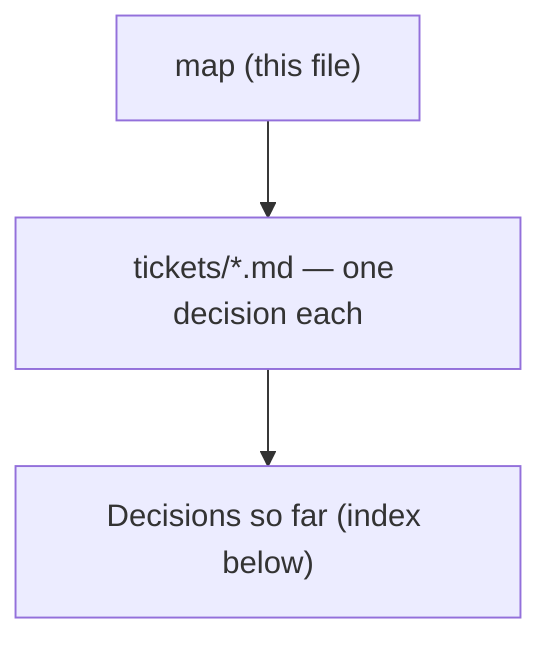

# Decision map - route every superpowers review step to scrutinize

## Destination
The superpowers skills that carry a review step are copied into this repo, with all seven review touchpoints routed to the existing scrutinize skill, running in both Claude Code and Antigravity, and with a documented path to resync the copies from upstream.

## Notes
Constraints fixed at chart time: scrutinize is FROZEN - the copies adapt to it as-is, its behaviour and output format do not change. Upstream is obra/superpowers, MIT (c) 2025 Jesse Vincent, vendored from sha b36e0829c6d0 (byte-identical to the 6.3.0 cache dir); the live plugin is a url-source clone, so editing the plugin cache is never the mechanism. Closure is ~2100 lines over six skill dirs plus subagent-driven-development/scripts/review-package, because touchpoints #1 (spec) and #2 (plan) live inside brainstorming and writing-plans rather than in standalone review skills. Distribution scope is this repo plus Antigravity only. Repo conventions apply to whatever ships: one PLAYBOOK.md row per skill, the diagram convention, versions and ADR numbers minted from the global max. Grilling tickets: load sp-grill-with-doc. The seven touchpoints: 1 brainstorming/spec-document-reviewer-prompt.md, 2 writing-plans/plan-document-reviewer-prompt.md, 3 requesting-code-review (SKILL.md + code-reviewer.md), 4 subagent-driven-development/task-reviewer-prompt.md, 5 subagent-driven-development/re-review-prompt.md, 6 receiving-code-review/SKILL.md, 7 executing-plans/SKILL.md.

## Decisions so far

<!-- decision-map:decisions:start -->
- [Coexistence - does the superpowers plugin stay enabled alongside the copies?](tickets/coexistence.md) — Plugin stays enabled; the six review-carrying originals go off via skillOverrides - the other eight skills stay live and the copies' outbound refs keep resolving.
- [Harness behaviour - how does Claude Code resolve two skills with the same name from different plugins?](tickets/harness-skill-shadowing.md) — Both load - no collision, since plugin skills are namespaced plugin:skill; skillOverrides switches off one skill without disabling its plugin.
<!-- decision-map:decisions:end -->

## Not yet specified

<!-- decision-map:fog:start -->
- Whether receiving-code-review (#6) still has a job once reviews come from scrutinize - it teaches how to TAKE feedback, not how to produce it, so it may need nothing, a light edit, or no copy at all.
- How the swap gets verified end-to-end - what acceptance check proves a real superpowers-style run actually reached scrutinize instead of the built-in reviewer.
- Whether subagent-driven-development/scripts/review-package needs to change, and what it assumes about the reviewer it packages for.
- How the host plugin's version is minted and whether .claude-plugin/marketplace.json needs a new entry or only a version bump.
<!-- decision-map:fog:end -->

## Out of scope

<!-- decision-map:scope:start -->
- Syncing the vendored skill copies tracked under menunest's .agents/ directory.
- The dev-playbook distribution at ~/Downloads/custom-skill - the active PAT cannot push to it.
- The separate superpowers copies under .gemini/extensions and .codex/plugins.
- Changing scrutinize's own behaviour, stance or output format - it is frozen by decision.
- Contributing any of this back upstream to obra/superpowers.
- Copying or replacing the eight superpowers skills that carry no review step - the coexistence decision keeps them live from the upstream plugin, and two of them (using-git-worktrees, finishing-a-development-branch) are load-bearing for the copies.
<!-- decision-map:scope:end -->
