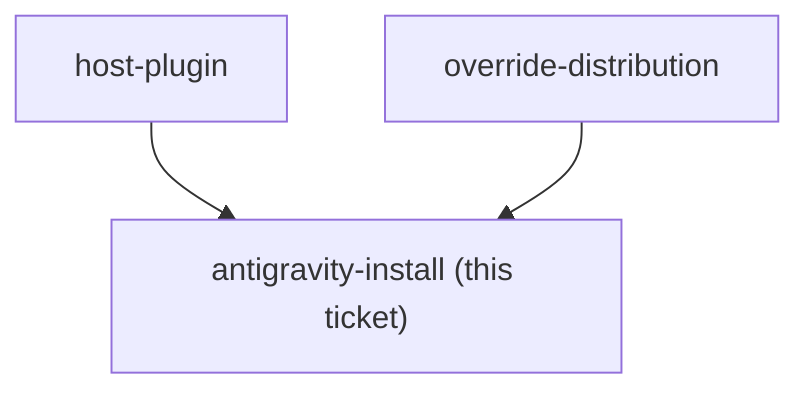
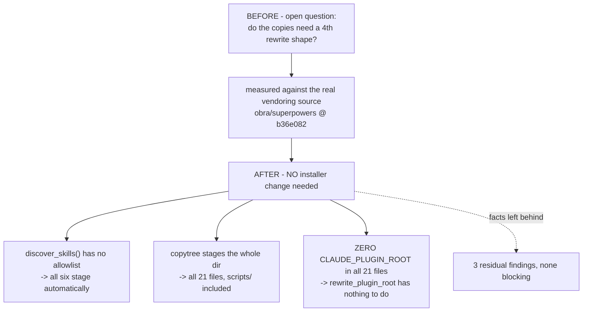

<!-- decision-map:graph:start -->

<!-- decision-map:graph:end -->

## Question

install-antigravity.py currently installs dev-workflows only and rewrites just the /references/, /scripts/ and /skills/ ${CLAUDE_PLUGIN_ROOT} shapes. Establish what the vendored skills actually reference, whether any new shape is needed in rewrite_plugin_root(), and what has to change for the copies to install under Antigravity.

## Comment

## Constraint from `attribution` — the licence notice must travel too (2026-08-15)

Not a resolution of this ticket. One extra thing this ticket now has to answer.

`attribution` decided the MIT notice ships as **one file beside the copies**,
`plugins/dev-workflows/LICENSE-superpowers`, rather than as per-file headers (which
[ADR 0075](../../../adr/0075-resync-is-a-checker-script-and-one-recorded-sha.md) rules out).

Distribution scope is **this repo plus Antigravity**. So a notice that does not travel with
the copies satisfies MIT in one place and not the other — and the repo is public, which is
what made the notice mandatory rather than courteous.

The question this adds here: **does `install-antigravity.py` carry a non-skill file from the
plugin root across, or does it stage only `skills/`?** If it stages only skills, the
Antigravity install ships 21 vendored files with no licence text, and the fix is part of
this ticket rather than a later cleanup.

Note this is a *file-staging* question, separate from the `rewrite_plugin_root()` shape
question this ticket already owns.


## Comment

## Answer to the licence sub-question, measured (2026-08-15, from `short-ref-resolution`)

The `attribution` ticket left a question here on 2026-08-14: does `install-antigravity.py`
carry a **non-skill file** from the plugin root across, or does it stage only `skills/`?

**It stages only `skills/`.** Read directly:

```python
def discover_skills() -> list[Path]:
    skills_root = PLUGIN_ROOT / "skills"
    return sorted(p for p in skills_root.iterdir() if (p / "SKILL.md").is_file())
```

Nothing else is ever enumerated. The only plugin-root material that travels is what
`rewrite_plugin_root()` copies into `<dest>/.dev-workflows-shared/` — `references/` and
`scripts/`, and those two only. So **`plugins/dev-workflows/LICENSE-superpowers` would not
be carried across** as the installer stands: an Antigravity install would ship the 21
vendored files with no licence text beside them, which is the one place MIT's condition
would go unmet.

This is now a concrete change with a known shape, not an open question — either add the
licence file to what the installer stages, or stage it into `.dev-workflows-shared/`
alongside `references/` and `scripts/`. It stays part of this ticket rather than
`attribution`, which is closed.

Two further facts from the same read, both useful here:

- The flat-staging premise **holds** — `${CLAUDE_PLUGIN_ROOT}/skills/` maps to `<dest>/`,
  one directory per skill, no namespace. So a bare `sp-` reference is the exact directory
  name on Antigravity and needs no prefix, confirming ADR 0071/0072 Decision 2 on that
  harness by construction rather than by assumption.
- **Nothing is staged on this machine today** (`~/.gemini/config/skills` does not exist),
  so no Antigravity behaviour has ever been observed here. Whatever this ticket decides
  should be validated by one real install once the copies land.

Evidence: [`short-ref-resolution`](short-ref-resolution.md).

<!-- decision-map:resolution:start -->
## Resolution

No installer change needed - the 21 files at b36e082 contain ZERO CLAUDE_PLUGIN_ROOT, so rewrite_plugin_root has nothing new to learn; three residual Antigravity facts recorded.



**Resolved by measurement, not reasoning.** `obra/superpowers` was cloned at
`b36e082` — the exact sha the map records as the vendoring source — and the six skill
directories check out against ADR 0074 to the digit: **21 files, 2407 Markdown lines and
1559 non-Markdown**. So what follows describes the real thing that will be copied, not a
reconstruction of it.

## The answer

`install-antigravity.py` **covers the copies as written**. No new rewrite shape, no
change to `rewrite_plugin_root()`.

Three independent reasons, each measured:

1. `discover_skills()` (lines 50-52) enumerates every directory under `skills/` holding
   a `SKILL.md`, with no allowlist and no per-skill flag. Six new directories are staged
   the moment they exist.
2. Staging is `shutil.copytree(skill, out)` — the whole directory. The copies' `scripts/`
   trees and their prompt files arrive with them; nothing enumerates file types.
3. **Not one of the 21 files contains `${CLAUDE_PLUGIN_ROOT}`** — Markdown or otherwise.
   The three shapes `rewrite_plugin_root()` knows are not merely sufficient; on these
   files the rewriter has no work at all. ADR 0074's one plugin-root-relative site,
   `brainstorming/SKILL.md:250`, is the bare path `skills/brainstorming/visual-companion.md`
   with no variable in it, and ADR 0074 already turns it skill-relative — which is the
   form Antigravity resolves natively.

## Three facts left behind

**1. The rewriter and its own safety net are Markdown-only.** Both the rewrite loop and
the leftover detector iterate `dest.rglob("*.md")`. The copies bring 8 non-Markdown files
(1559 lines). Today that costs nothing — those files hold no plugin-root reference — but
it is a property of the tool, not a guarantee about the future: an upstream change that
introduces one into `server.cjs` would stage unrewritten *and* unwarned, because the
detector cannot see the file either. Worth a line in ADR 0075's resync checker.

**2. One non-Markdown path assumption changes meaning under flat staging.**
`brainstorming/scripts/server.cjs:209` computes `path.join(__dirname, '../../..')`. From
`<plugin>/skills/brainstorming/scripts/` that is the plugin root; from Antigravity's
`<dest>/sp-brainstorming/scripts/` it is the **parent of the skills directory**. It is
used only by `readSuperpowersVersion()`, whose manifest reads are `try`/`catch`-guarded
and fall through, so it degrades to an unknown version rather than failing. Every other
path in the 8 files is self-relative (`__dirname`, `$(cd "$(dirname "$0")" && pwd)`) and
survives staging unchanged.

**3. One relative reference dangles on Antigravity, and it is not the installer's
fault.** Flat staging makes sibling paths work: after ADR 0074's rewrite,
`../sp-requesting-code-review/code-reviewer.md` resolves correctly from
`<dest>/sp-subagent-driven-development/` (and 3 of those 4 sites — `SKILL.md` lines 88,
117, 118 — are graphviz label text rather than live links; only line 454 is a real link).
But `../using-superpowers/references/` at `executing-plans/SKILL.md:14` names one of the
**eight non-copied** skills. Nothing stages a `using-superpowers` directory into
`<dest>/`, so that path dangles there whatever the rewrite pass does with it. It belongs
to ADR 0074/0075's rewrite pass, not to the installer, and is recorded here rather than
decided.

## Scope note

This ticket asked about the installer, and the installer is fine. Findings 2 and 3 are
about the *content* being staged, not the staging mechanism, so they are recorded as
facts for the rewrite pass rather than resolved here.

<!-- decision-map:resolution:end -->
