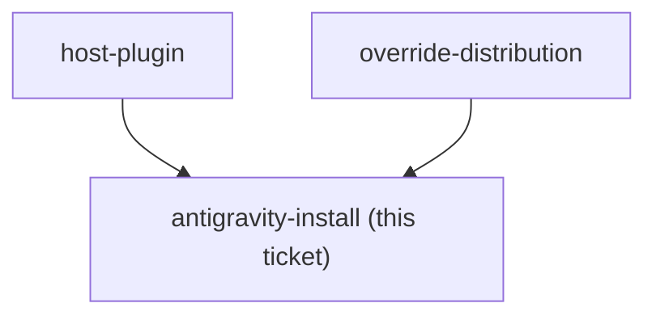

<!-- decision-map:graph:start -->

<!-- decision-map:graph:end -->

## Question

install-antigravity.py currently installs dev-workflows only and rewrites just the /references/, /scripts/ and /skills/ ${CLAUDE_PLUGIN_ROOT} shapes. Establish what the vendored skills actually reference, whether any new shape is needed in rewrite_plugin_root(), and what has to change for the copies to install under Antigravity.
