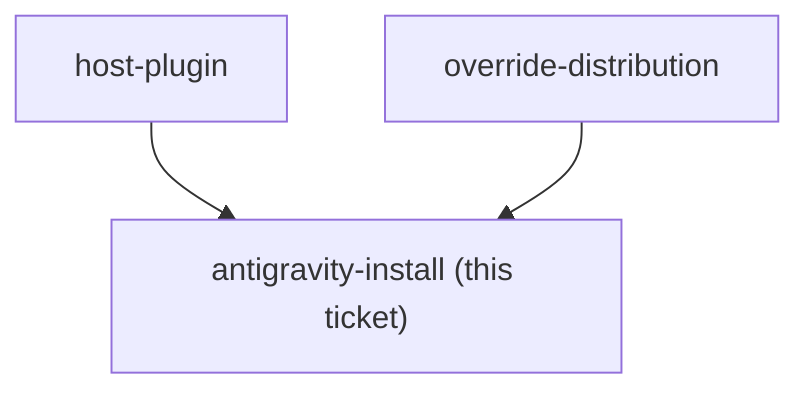

<!-- decision-map:graph:start -->

<!-- decision-map:graph:end -->

## Question

install-antigravity.py currently installs dev-workflows only and rewrites just the /references/, /scripts/ and /skills/ ${CLAUDE_PLUGIN_ROOT} shapes. Establish what the vendored skills actually reference, whether any new shape is needed in rewrite_plugin_root(), and what has to change for the copies to install under Antigravity.

## Comment

## Constraint from `attribution` — the licence notice must travel too (2026-08-15)

Not a resolution of this ticket. One extra thing this ticket now has to answer.

`attribution` decided the MIT notice ships as **one file beside the copies**,
`plugins/dev-workflows/LICENSE-superpowers`, rather than as per-file headers (which
[ADR 0075](../../../adr/0075-resync-is-a-checker-script-and-one-recorded-sha.md) rules out).

Distribution scope is **this repo plus Antigravity**. So a notice that does not travel with
the copies satisfies MIT in one place and not the other — and the repo is public, which is
what made the notice mandatory rather than courteous.

The question this adds here: **does `install-antigravity.py` carry a non-skill file from the
plugin root across, or does it stage only `skills/`?** If it stages only skills, the
Antigravity install ships 21 vendored files with no licence text, and the fix is part of
this ticket rather than a later cleanup.

Note this is a *file-staging* question, separate from the `rewrite_plugin_root()` shape
question this ticket already owns.

