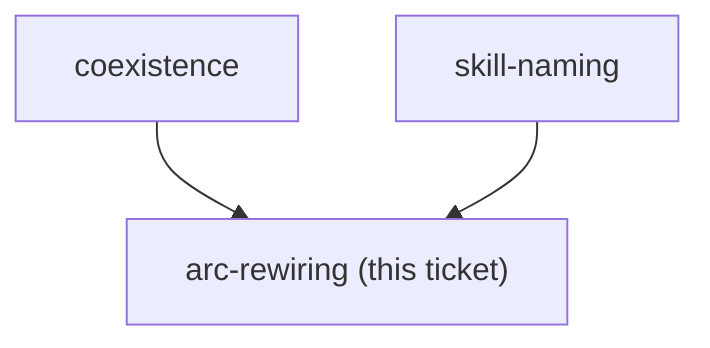

<!-- decision-map:graph:start -->

<!-- decision-map:graph:end -->

## Question

grill-then-plan hands off to superpowers:writing-plans, work-map and problem-description reference superpowers skills, and PLAYBOOK.md plus the daily router index them. Which of these must be repointed at the copies, and which are left alone?
