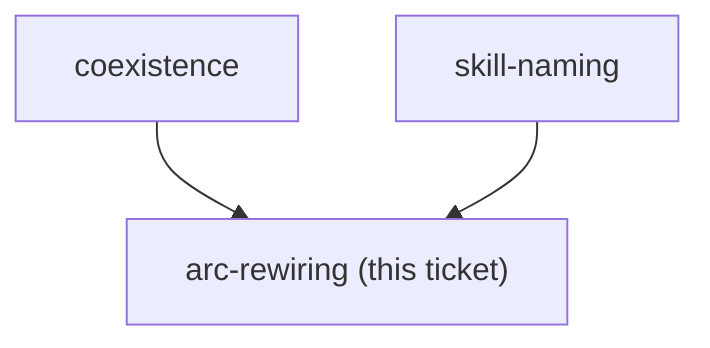
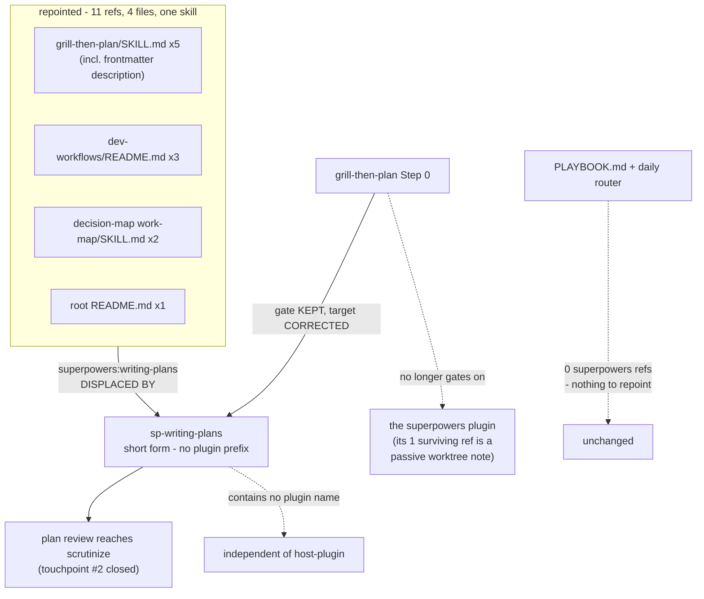

<!-- decision-map:graph:start -->

<!-- decision-map:graph:end -->

## Question

grill-then-plan hands off to superpowers:writing-plans, work-map and problem-description reference superpowers skills, and PLAYBOOK.md plus the daily router index them. Which of these must be repointed at the copies, and which are left alone?

<!-- decision-map:resolution:start -->
## Resolution

All 11 refs - one skill, 4 files - become short-form sp-writing-plans; grill-then-plan Step 0 retargets to it; PLAYBOOK and the daily router need no change, they never named superpowers.

Detail: docs/adr/0072-arc-handoffs-name-sp-writing-plans-in-short-form-and-the-preflight-retargets.md

## What was measured before it was decided

On `252f338` (`main`), tracked files: **11 qualified refs, and every one names the
same skill** — `superpowers:writing-plans`. The ticket's Question assumed a four-way
ripple; two of its four premises are false:

- `PLAYBOOK.md` and the `daily` router hold **zero** superpowers references. They
  index this repo's own arc skills. Nothing in either to repoint.
- `problem-description/SKILL.md:100` named `superpowers:systematic-debugging` — not
  one of the six copies, and a *"use X instead"* pointer, not a handoff.

The stake: ADR 0070 keeps the upstream plugin **fully enabled**, so a ref left alone
does not error — it resolves to the *unpatched* skill and the plan review silently
reaches the built-in reviewer instead of `scrutinize`.

## The three answers

1. **All 11 repointed, the READMEs included.** Fixing only the 7 executable handoffs
   leaves the docs describing a handoff the code no longer makes, and the next reader
   repairs the code to match the docs.
2. **Short form everywhere, including across plugins.** ADR 0071's Antigravity
   rationale does *not* reach `work-map` (only `dev-workflows` ships an `.antigravity/`
   installer, and `work-map` qualifies all 3 of its cross-plugin refs today). Short
   form wins on a different ground: it contains no plugin name, so this ticket
   **resolves without waiting on `host-plugin`** and needs no rewrite after it.
3. **Step 0 retargets, it is not deleted.** It gates on `sp-writing-plans` being
   available instead of on the superpowers plugin. Its detection is already
   skill-availability, so no plugin name enters it. Superpowers stops being a
   functional dependency: on `6.3.0`/`b36e0829c6d0`, `writing-plans`' one non-copied
   ref is `superpowers:using-git-worktrees` at `SKILL.md:16`, a passive context note,
   never an invocation.

## Confirmed by the user

Answering four framed choices in turn, they took: **"All 11, docs included"**,
**"Short form, everywhere"**, **"Retarget the gate to sp-writing-plans"**, and — on
scope — **"Hand it to convention-compliance"** and **"Record it, do not own it"**.

## Handed on, not decided here

- **Six PLAYBOOK rows** for the copies → `convention-compliance` (an addition, not a
  repoint; and it needs `copy-granularity` first).
- **`problem-description:100`** — the working tree already swaps
  `superpowers:systematic-debugging` for `debug-mantra`. Recorded so it is not
  re-derived; not owned by this ticket, since that skill carries no review touchpoint
  and is not being copied.

<!-- decision-map:resolution:end -->
