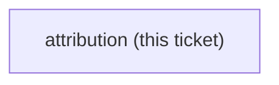

<!-- decision-map:graph:start -->

<!-- decision-map:graph:end -->

## Question

superpowers is MIT, (c) 2025 Jesse Vincent. Decide and apply the attribution mechanics for the copies: a vendored LICENSE file, a NOTICE, per-file provenance headers, or a line in the host plugin's README - and confirm the chosen form satisfies the licence for modified copies.
