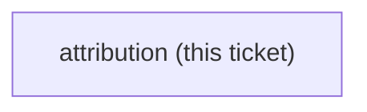

<!-- decision-map:graph:start -->

<!-- decision-map:graph:end -->

## Question

superpowers is MIT, (c) 2025 Jesse Vincent. Decide and apply the attribution mechanics for the copies: a vendored LICENSE file, a NOTICE, per-file provenance headers, or a line in the host plugin's README - and confirm the chosen form satisfies the licence for modified copies.

## Comment

## Constraint from `resync-path` — a per-file notice would break the resync diff (2026-08-14)

Not a resolution of this ticket. One option is now ruled out, and the reason is worth
having before the grilling starts.

[ADR 0075](../../../adr/0075-resync-is-a-checker-script-and-one-recorded-sha.md) makes
resync a **plain per-file diff against one recorded sha**: 12 of the 21 files must be
byte-identical to upstream, and a checker asserts exactly that.

So **injecting an MIT notice (or an "upstream: sha" line) into each copied file is not
available.** It would make all 21 files differ from upstream, delete the verbatim set the
checker is built on, and turn every future pull into a diff carrying a deliberate
modification that has to be re-applied and re-verified by hand — the same cost
[ADR 0074](../../../adr/0074-the-six-skills-are-vendored-whole-then-one-rewrite-pass.md)
refused when it declined to drop the visual companion.

The nine files that already take edits are a different case: they are `edited` in the
manifest, so a notice in those costs nothing structurally. Whether a notice on nine files
but not twelve is acceptable licence practice is this ticket's question, not ADR 0075's.

Shapes that stay open: a single `LICENSE`/`NOTICE` file beside the copies; the notice in
the manifest that ADR 0075 already requires; a line in the plugin README; a notice only in
the nine edited files. Upstream is MIT (c) 2025 Jesse Vincent.

