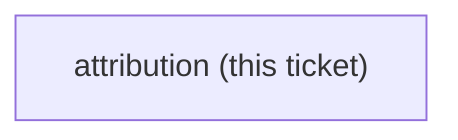
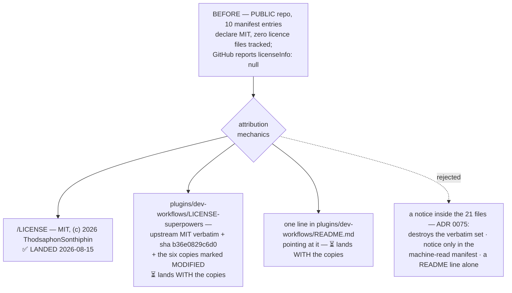

<!-- decision-map:graph:start -->

<!-- decision-map:graph:end -->

## Question

superpowers is MIT, (c) 2025 Jesse Vincent. Decide and apply the attribution mechanics for the copies: a vendored LICENSE file, a NOTICE, per-file provenance headers, or a line in the host plugin's README - and confirm the chosen form satisfies the licence for modified copies.

## Comment

## Constraint from `resync-path` — a per-file notice would break the resync diff (2026-08-14)

Not a resolution of this ticket. One option is now ruled out, and the reason is worth
having before the grilling starts.

[ADR 0075](../../../adr/0075-resync-is-a-checker-script-and-one-recorded-sha.md) makes
resync a **plain per-file diff against one recorded sha**: 12 of the 21 files must be
byte-identical to upstream, and a checker asserts exactly that.

So **injecting an MIT notice (or an "upstream: sha" line) into each copied file is not
available.** It would make all 21 files differ from upstream, delete the verbatim set the
checker is built on, and turn every future pull into a diff carrying a deliberate
modification that has to be re-applied and re-verified by hand — the same cost
[ADR 0074](../../../adr/0074-the-six-skills-are-vendored-whole-then-one-rewrite-pass.md)
refused when it declined to drop the visual companion.

The nine files that already take edits are a different case: they are `edited` in the
manifest, so a notice in those costs nothing structurally. Whether a notice on nine files
but not twelve is acceptable licence practice is this ticket's question, not ADR 0075's.

Shapes that stay open: a single `LICENSE`/`NOTICE` file beside the copies; the notice in
the manifest that ADR 0075 already requires; a line in the plugin README; a notice only in
the nine edited files. Upstream is MIT (c) 2025 Jesse Vincent.

<!-- decision-map:resolution:start -->
## Resolution

Upstream MIT ships verbatim in dev-workflows/LICENSE-superpowers with the sha and a MODIFIED marker, never per-file; the repo also gained the top-level LICENSE it never had.

One file beside the copies carries upstream's MIT text verbatim; nothing is injected into
any of the 21 vendored files, so the 12 verbatim files stay verbatim and ADR 0075's
checker is unaffected.

## Why a notice was required, not optional

Two facts were measured on this ticket, and both were new:

1. **The repo is PUBLIC** — `github.com/ThodsaphonSonthiphin/workflow-daily-work`,
   `gh repo view` reports `"visibility": "PUBLIC"`. Distribution is real, so MIT's one
   condition binds: the copyright notice and the permission notice must ship with *"all
   copies or substantial portions of the Software"*. 21 files and ~3,966 lines is a
   substantial portion by any reading.
2. **No licence file was tracked anywhere in the repo**, while **10 manifest entries
   already declared `"license": "MIT"`** (5 in `.claude-plugin/marketplace.json`, one in
   each of the five `plugin.json` files). GitHub agreed: `"licenseInfo": null`.

The second is a pre-existing defect independent of this map — a public repo asserting MIT
in ten places with no licence text — and it is why the answer has two halves rather than
one.

## What landed today

`/LICENSE` — MIT, `Copyright (c) 2026 ThodsaphonSonthiphin` (the `owner` recorded in
`marketplace.json`). The permission text was asserted **byte-identical** to upstream's own
MIT body before writing, so the two grants cannot be read as differing instruments.

## What lands WITH the copies, specified here so it is not re-decided

The six vendored skills **do not exist yet** — `plugins/dev-workflows/skills/` currently
holds only this repo's own `sp-grill-with-doc`. A licence file naming six absent skills
would be false, so these two are specified now and created in the same change that lands
the copies:

**`plugins/dev-workflows/LICENSE-superpowers`** — in this order:

1. A provenance block: upstream `https://github.com/obra/superpowers`, version `6.3.0`,
   commit `b36e0829c6d0`, the vendoring date.
2. The six copy↔upstream pairs (`sp-brainstorming` ← `brainstorming`, and so on) — the
   same one-to-one mapping [ADR 0071](../../../adr/0071-vendored-review-skills-take-the-sp-prefix-and-displace-upstream-by-description.md)
   already requires.
3. **An explicit MODIFIED marker**: nine of the twenty-one files carry local edits, twelve
   are byte-identical, and the manifest is the authority on which is which. MIT does not
   compel this line — it protects the upstream author from being credited with our edits,
   and it is what makes the notice honest.
4. Upstream's MIT text, **verbatim and unaltered**, under `Copyright (c) 2025 Jesse
   Vincent`.

**`plugins/dev-workflows/README.md`** — one line pointing at that file.

## Why not the alternatives

- **A notice inside each vendored file** was already ruled out by
  [ADR 0075](../../../adr/0075-resync-is-a-checker-script-and-one-recorded-sha.md), and the
  comment above records it: it would make all 21 files differ from upstream and delete the
  verbatim set the checker is built on. MIT never asked for per-file notices.
- **The notice only in the ADR 0075 manifest** — rejected because that ADR defines the
  manifest as *"one file beside the copies, read only by the program"*. A licence a human
  cannot find is not a notice.
- **A README line alone** — rejected: MIT requires the permission notice itself, not a
  pointer to it.

## The owner's words

Against the recommendation above, stated as three files with the real before/after path:

> **ok**

## Facts later tickets can use

- Upstream ships exactly one `LICENSE`, at its plugin root; there is no `NOTICE` file and
  no per-file header anywhere in `6.3.0`. Copying its shape is therefore also the
  lowest-surprise choice for anyone who knows the upstream project.
- `antigravity-install` should check whether `install-antigravity.py` carries
  `LICENSE-superpowers` across. Distribution scope is this repo **plus Antigravity**, and a
  notice that does not travel with the copies satisfies MIT in one place and not the other.

<!-- decision-map:resolution:end -->
