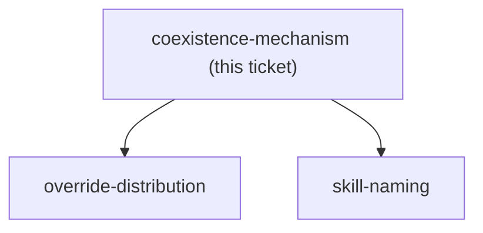

<!-- decision-map:graph:start -->

<!-- decision-map:graph:end -->

## Question

skillOverrides has now been observed inert against every plugin-provided skill (CC 2.1.232), so ADR 0069's chosen mechanism does not exist and the menu is back to the two options it rejected. Option B: disable superpowers whole - the hook goes silent and the copies win cleanly, but 8 non-review skills disappear, 3 references in this marketplace break, 3 references INSIDE the copies dangle, and the copy job grows from 6 skills to 8 (2407 to 2799 lines). Option C: leave the plugin fully on - nothing breaks and nothing is vendored twice, but the SessionStart hook keeps injecting text that names superpowers:brainstorming and superpowers:systematic-debugging by qualified name, with more authority than any description, so the copies must win the trigger contest against it or scrutinize silently never runs. Which one, and if C, what makes a copy win against the hook? The answer decides skill-naming (identical names are only possible if the originals are gone) and override-distribution (what there is left to distribute at all).
