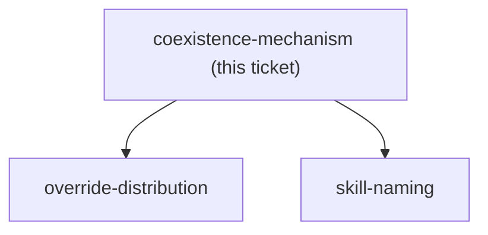
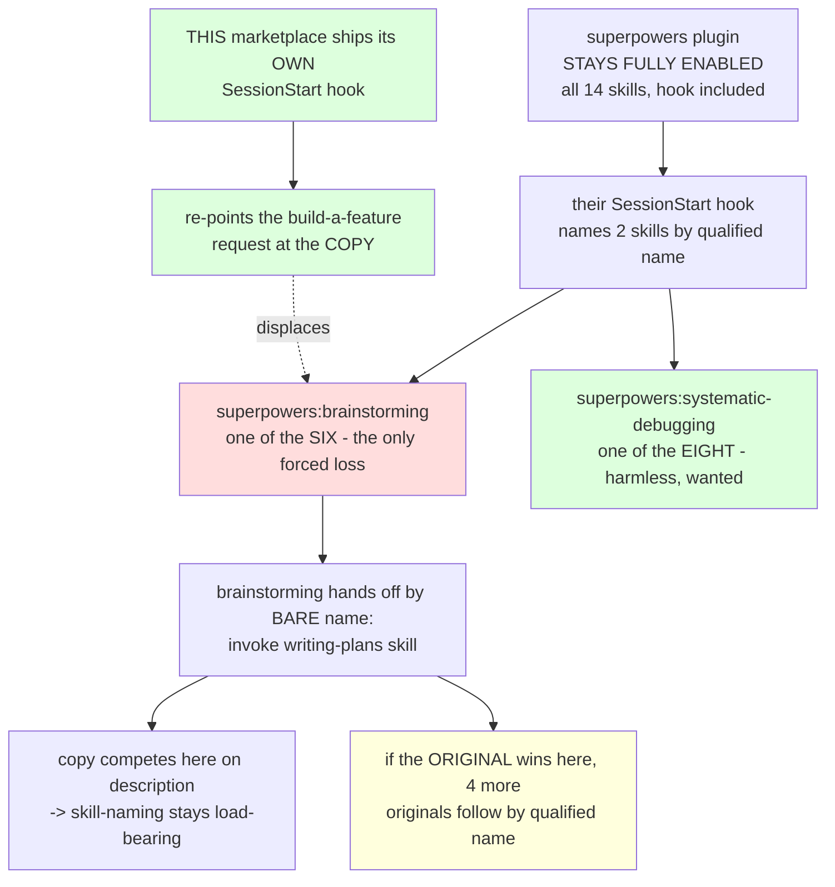

<!-- decision-map:graph:start -->

<!-- decision-map:graph:end -->

## Question

skillOverrides has now been observed inert against every plugin-provided skill (CC 2.1.232), so ADR 0069's chosen mechanism does not exist and the menu is back to the two options it rejected. Option B: disable superpowers whole - the hook goes silent and the copies win cleanly, but 8 non-review skills disappear, 3 references in this marketplace break, 3 references INSIDE the copies dangle, and the copy job grows from 6 skills to 8 (2407 to 2799 lines). Option C: leave the plugin fully on - nothing breaks and nothing is vendored twice, but the SessionStart hook keeps injecting text that names superpowers:brainstorming and superpowers:systematic-debugging by qualified name, with more authority than any description, so the copies must win the trigger contest against it or scrutinize silently never runs. Which one, and if C, what makes a copy win against the hook? The answer decides skill-naming (identical names are only possible if the originals are gone) and override-distribution (what there is left to distribute at all).

<!-- decision-map:resolution:start -->
## Resolution

Plugin stays FULLY on; this marketplace ships its OWN SessionStart hook that re-points the one skill the upstream hook names - measured 3/3 against a 2/2 control, not assumed.

Detail: docs/adr/0070-host-sessionstart-hook-repoints-the-one-skill-the-upstream-hook-names.md

Detail is in ADR 0070, linked above; it is canonical and this block does not
restate it. What belongs here is the shape of the answer and how it was reached.

## What displaced what

Three positions were put to the user, after exploration showed the ticket's own
framing was wrong on three counts. Their hook forces **one** of the six, not six
(it names `brainstorming` and `systematic-debugging`, and only the first is being
copied). `brainstorming` hands off by **bare** name, so the chain past it is
contestable rather than forced. And option B's cost inside this marketplace is
**one** live breaking reference measured on `24a4b64`, not the three ADR 0069
recorded — 10 of the 11 qualified references name `writing-plans`, which is being
vendored anyway.

That exploration also produced a third option the ticket did not offer, and it won:
a plugin can ship its own SessionStart hook, so the upstream hook can be answered
in kind instead of silenced.

## The test that made it a decision rather than a preference

I would not record this on reasoning alone — ADR 0069 was lost exactly that way.
Five `claude -p` runs, one prompt, one cwd:

| session | answer to "name the ONE skill you would invoke first" |
|---|---|
| upstream hook only, ×2 | `superpowers:brainstorming`, twice |
| upstream hook + a host hook, ×3 | `superpowers:writing-plans`, three times |

The control is half the value: it is the first actual measurement that their hook
steers at all, which ADR 0069 asserted and never checked. All three registered
SessionStart hooks fire, and both texts arrive in one merged attachment — with ours
**first**, ahead of theirs, and it still won. So the win is on specificity, not on
position, which is the more durable property and also the constraint on how the
hook must be worded.

## What this leaves for other tickets

- `skill-naming` is unblocked and now *more* load-bearing: the bare
  `"writing-plans skill"` seam is won on description quality, and the host hook has
  to name the copies exactly.
- `resync-path` gains two checks that no compile gate can catch: upstream adding a
  qualified reference inside `brainstorming` (which would turn the contestable seam
  into a forced one), and upstream renaming a skill the host hook names (which would
  silently make the hook a no-op). Noted on both tickets.
- Nothing new was charted and no fog was graduated. The two risks above belong to
  tickets that already exist, and inventing tickets for them would only duplicate
  their scope.

## Honest limit on the evidence

This is steering, not a gate. Three of three is a strong signal from a small
sample, not a proof, and the outcome is model judgement rather than an enforced
switch. Treat the hook as defence-in-depth alongside the copies' own descriptions.
The stand-in hook also used two existing skills rather than real copies, because the
copies do not exist yet; what was tested is the authority contest, not the final
wording.

## Confirmation

Three options were put to the user as a table, with the observable consequence of
each spelled out for a "let's build a feature" request, and with my own bias
declared — I produced the evidence that makes option D look good. The user chose:

> d

The user also directed that this ticket be worked in the same session that resolved
its predecessor, after I recommended a fresh session to avoid that anchoring. Their
call, recorded here because it is the one thing a later reader cannot see.

<!-- decision-map:resolution:end -->

## Comment

## Correction — 2026-08-14: this ticket's ADR overstated what option C loses

Found while resolving `copy-granularity`. **The decision on this ticket stands** — the gist
and the 3/3-against-2/2 measurement are unaffected — and the correction is to one supporting
claim in the ADR, not to the answer.

**What was believed:** ADR 0070's *"Why not leave it alone (option C)"* concluded that
*"Touchpoint #1 is lost by force under C … a guaranteed one-touchpoint loss."* That treated
`brainstorming/spec-document-reviewer-prompt.md` as a reviewer dispatch, which is what the
chart's touchpoint list said.

**What is measured** (superpowers `b36e0829c6d0`, the vendoring source): that file is
referenced by nothing outside `docs/` and `RELEASE-NOTES.md`. The live step at that stage is
an inline checklist the same agent runs — *"Fix any issues inline. No need to re-review — just
fix and move on"* (`brainstorming/SKILL.md:219`). Touchpoint #2 in `writing-plans` is the
same and says so outright: *"This is a checklist you run yourself — not a subagent dispatch"*
(`SKILL.md:143`).

**Why the conclusion survives, and hardens.** What the upstream hook forces is not the loss
of a reviewer but the **entry into the upstream chain**: upstream `brainstorming` hands off in
prose to upstream `writing-plans`, which names `superpowers:subagent-driven-development` by
qualified name, which names `superpowers:requesting-code-review` — and those last two hold
**all four** real reviewer dispatches. Option C risks the whole chain, not one touchpoint, so
rejecting it was right for a bigger reason than the ADR gave.

Recorded per the map's rule for a closed ticket's false fact: the gist is left as the audit
trail of what was verified then, ADR 0070 carries a dated amendment that scopes the claim
rather than deleting it, and ADR 0074 carries the measurement.

