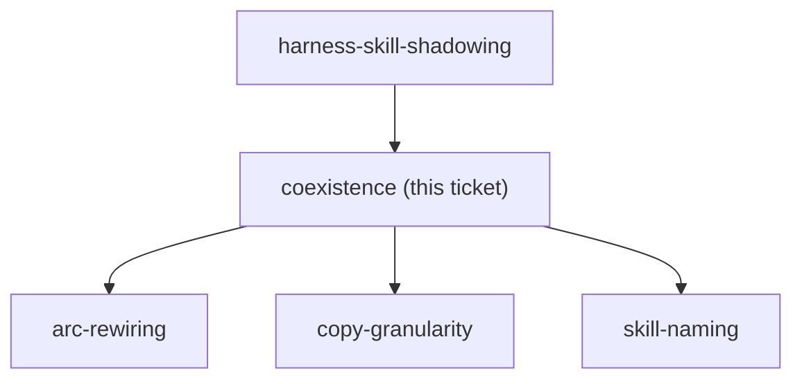
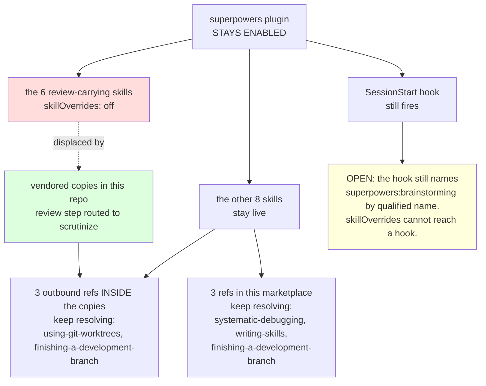

<!-- decision-map:graph:start -->

<!-- decision-map:graph:end -->

## Question

Do we keep superpowers@claude-plugins-official enabled and accept two copies of brainstorming / writing-plans / the review skills competing for the same triggers, or disable it and take over every skill we depend on (including the ones with no review step)? The answer sets the naming, the copy granularity and how much of the daily arc has to be repointed.

<!-- decision-map:resolution:start -->
## Resolution

Plugin stays enabled; the six review-carrying originals go off via skillOverrides - the other eight skills stay live and the copies' outbound refs keep resolving.

Detail: docs/adr/0069-the-upstream-plugin-stays-enabled-its-review-skills-go-off-per-skill.md

The reasoning, the three rejected positions and the two holes this answer leaves
are in ADR 0069, linked above. It is canonical; this block does not restate it.

## What it graduated onto the map

- `skilloverrides-live-check` (task) — the hook still names
  `superpowers:brainstorming` by qualified name after it is switched off, and the
  exact key form `skillOverrides` expects for a plugin skill was inferred, never
  observed. Blocks `skill-naming`.
- `override-distribution` (grilling) — a plugin cannot ship a settings key, so on
  a machine without those six entries this decision degrades silently into
  "change nothing". Blocks `antigravity-install`.

## One measurement was corrected in session

An in-session figure of **5** references from this marketplace to non-review
superpowers skills is **wrong** — it double-counted the
`.claude/worktrees/decision-map/` checkout. The measured count on `29ff84c`,
tracked files only and excluding `docs/decision-map/`, is **3**, and that is the
figure the ADR carries. The correction did not change the decision.

## Confirmation

Four positions were put to the user as a table, with this one recommended and the
consequence of "change nothing" walked through concretely. The user answered:

> b

<!-- decision-map:resolution:end -->

## Comment

## Correction (2026-08-14): the chosen mechanism does not exist

This ticket's recorded answer is **not implementable on Claude Code 2.1.232**. The
resolution stands as the audit trail of what was decided and why - the three
rejected positions were rejected on reasoning that still holds - but the mechanism
it selected has now been observed to have no effect.

**What the gist claims:** "the six review-carrying originals go off via
`skillOverrides` - the other eight skills stay live".

**What was measured** (`skilloverrides-live-check`, on Claude Code 2.1.232, this
repo at `2e535ef`, read off the `system/init` event's `skills` array):

| `skillOverrides` payload | skills listed | the named skill still reachable? |
|---|---|---|
| *(control)* | 211 | - |
| `superpowers:brainstorming: off` | 211 | **yes** |
| `brainstorming: off` | 211 | **yes** |
| `find-skills: off` (non-plugin) | 210 | no |

`skillOverrides` is inert against **any** plugin-provided skill, under both key
forms. The resolver exits with `"on"` the moment it sees `e.source==="plugin"`,
before the override map is read, and it is the single resolver behind both the
listing and the `/`-invocation refusal. The qualified-key support that does exist
is for directory-scoped project skills, not plugin namespacing.

**Scope of the original claim:** it was true of nothing - not of an earlier
version, not of a different key form. It was inferred from
`harness-skill-shadowing`'s "strong reading", which this ticket's own graduation
note correctly flagged as never observed. That is the hole working exactly as
intended.

**What survives:** the plugin *can* be disabled whole
(`enabledPlugins: {"superpowers@claude-plugins-official": false}` took 211 skills
to 197 and silenced the SessionStart hook in the same run), and this ticket's
finding that a hook cannot be reached by a listing control is not only still true
but stronger than recorded: `hooks/session-start` `cat`s
`skills/using-superpowers/SKILL.md` off disk and injects it verbatim, so it never
consults the skill registry at all.

**Consequence:** the real menu collapses to the two options ADR 0069 ruled out -
whole plugin off (its option B) or plugin fully on with the copies competing
against a hook that names the originals (its option C). ADR 0069 carries a dated
amendment. The re-decision is tracked as its own ticket rather than substituted
in here, because it is the user's call and it changes the shape of the effort.

