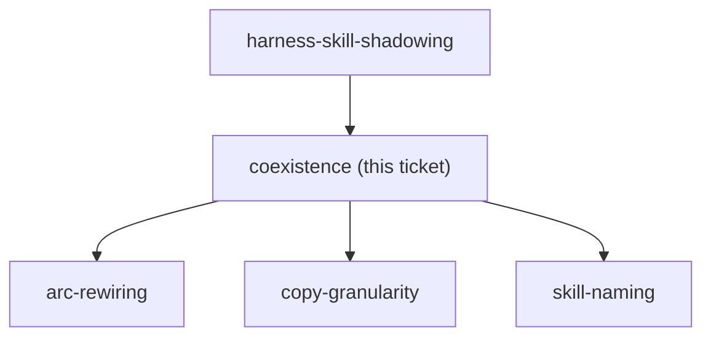

<!-- decision-map:graph:start -->

<!-- decision-map:graph:end -->

## Question

Do we keep superpowers@claude-plugins-official enabled and accept two copies of brainstorming / writing-plans / the review skills competing for the same triggers, or disable it and take over every skill we depend on (including the ones with no review step)? The answer sets the naming, the copy granularity and how much of the daily arc has to be repointed.
