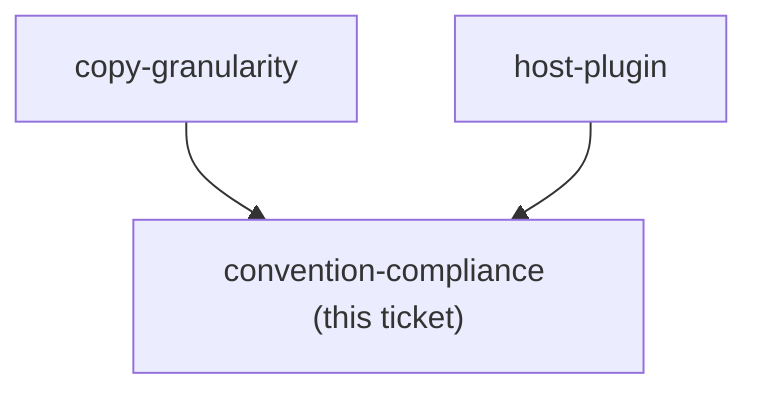

<!-- decision-map:graph:start -->

<!-- decision-map:graph:end -->

## Question

The repo requires harness-neutral wording, ${CLAUDE_PLUGIN_ROOT} only in the three shapes the Antigravity installer rewrites, an opening Mermaid diagram on generated documents, and one PLAYBOOK.md row per skill. Which of these bind a vendored foreign skill, given that every deviation from upstream text is a line the resync has to reconcile forever?
