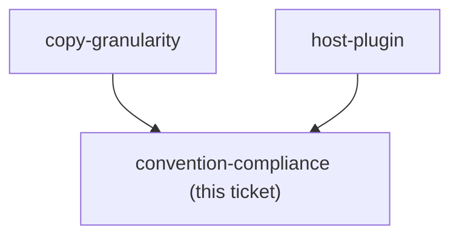
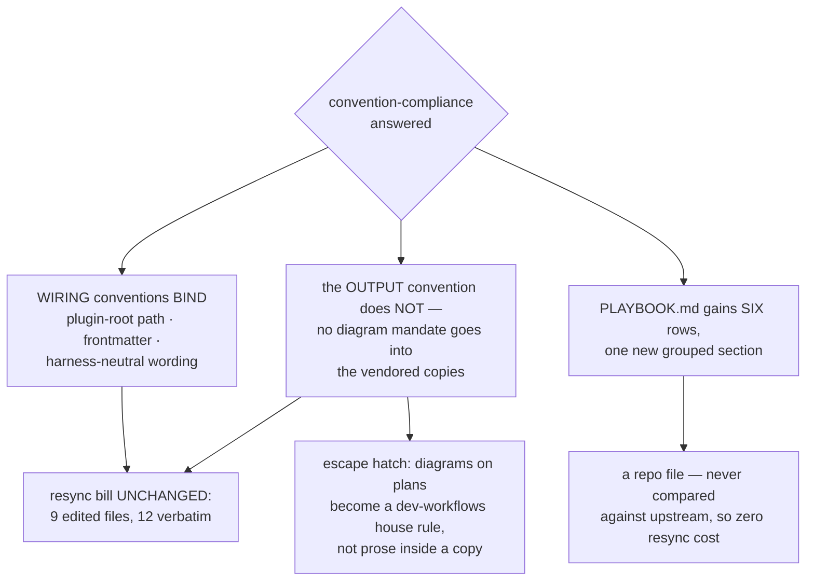

<!-- decision-map:graph:start -->

<!-- decision-map:graph:end -->

## Question

The repo requires harness-neutral wording, ${CLAUDE_PLUGIN_ROOT} only in the three shapes the Antigravity installer rewrites, an opening Mermaid diagram on generated documents, and one PLAYBOOK.md row per skill. Which of these bind a vendored foreign skill, given that every deviation from upstream text is a line the resync has to reconcile forever?

<!-- decision-map:resolution:start -->
## Resolution

Three wiring conventions bind at zero new cost - already ADR 0074 edits, or already satisfied; the Mermaid rule does not reach the copies' output; PLAYBOOK gains six rows.

Detail: docs/adr/0077-three-conventions-bind-the-copies-the-mermaid-rule-does-not.md

The split is between **how a copy is wired** and **what a copy produces**. The three wiring
conventions bind, and cost nothing new: two of them edit lines
[ADR 0074](../../../adr/0074-the-six-skills-are-vendored-whole-then-one-rewrite-pass.md)
already scheduled (class 3 and class 5), and the third — harness-neutral wording — turned
out to be satisfied as upstream already writes it. The one output convention does not bind.

**Correction carried from the grilling:** harness-neutral wording was expected to be the
expensive one, converting part of the 12-file verbatim set permanently. Measured, it costs
**0 files**. The literal `Claude Code` appears at three sites, each already correct or
already an edit site, and the pervasive *"dispatch a subagent"* wording names an action —
which is the rule's own test.

## The owner's words

On the Mermaid half, against four reasons and the real edit site
(`writing-plans/SKILL.md:56`):

> **ไม่บังคับ**  — *not binding*

On the PLAYBOOK half, against a pitch that named "6 แถวรวมหัวข้อเดียว" (six rows, one
grouped section) as the recommended option:

> **ok**

## Scope of the exemption

The Mermaid exemption covers the six vendored copies and the documents they generate. It
does **not** reach this repo's own skills, its ADRs, or decision-map ticket resolutions —
all of which still follow `plugins/dev-workflows/references/diagram-convention.md`. A
vendored `SKILL.md` with no diagram instruction is a deliberate absence, not an oversight.

<!-- decision-map:resolution:end -->
