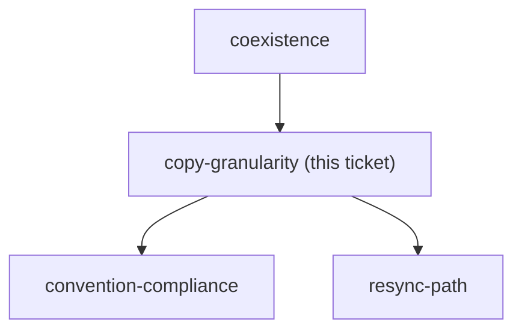
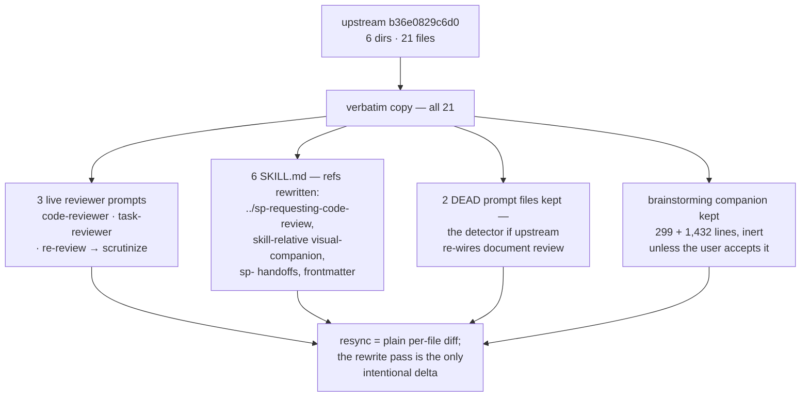

<!-- decision-map:graph:start -->

<!-- decision-map:graph:end -->

## Question

Do we vendor all six affected skill directories wholesale (~2100 lines, including 250-line brainstorming and 568-line subagent-driven-development that are mostly unrelated to review), or copy only the four reviewer prompt files plus thin skills that delegate the rest to superpowers? Weigh the maintenance surface against the coupling each option leaves behind.

<!-- decision-map:resolution:start -->
## Resolution

All 21 files copied verbatim plus one rewrite pass; shims are impossible - a reviewer prompt is a RELATIVE link inside the SKILL.md, so only a copied SKILL.md can redirect a dispatch.

Detail: docs/adr/0074-the-six-skills-are-vendored-whole-then-one-rewrite-pass.md

All 21 files copied verbatim, then one rewrite pass over five enumerated classes of
reference: the 3 live reviewer prompts → `scrutinize`; the cross-skill relative paths that
break on the `sp-` rename; `brainstorming`'s plugin-root-relative `visual-companion.md`
path; the qualified handoffs among the six → short `sp-` names; and the frontmatter.
Everything else is byte-identical.

**Re-scope during the session — the ticket asked the wrong question in two ways.**

*"Thin skills that delegate the rest to superpowers"* is not a cheaper option, it is a
non-functional one. A reviewer prompt is chosen by a **relative markdown link inside the
SKILL.md** (`[code-reviewer.md](code-reviewer.md)`, `./task-reviewer-prompt.md`), so a shim
delegating to `superpowers:requesting-code-review` resolves that link against the upstream
directory and the built-in reviewer runs with no error. Only a copied-and-edited SKILL.md
can redirect a dispatch.

And there are **three** reviewer prompt files, not four. Measured against the vendoring
source, four of the seven charted touchpoints are not reviewer dispatches, and two of those
name files nothing references: touchpoints #1 and #2 are dead files whose live step is an
inline self-review checklist, #6 dispatches nothing, #7 has the agent review the plan
itself. The four real dispatches all live in `requesting-code-review` and
`subagent-driven-development`. The set of six survives on a different basis than the chart
recorded — the other four are copied for their **qualified handoffs**, which re-enter the
originals one step later if left upstream.

The user chose the fullest option over trimming `brainstorming`'s 1,731-line visual
companion, which keeps two properties: `sp-brainstorming` does not silently lose a feature
for a reason unrelated to review, and resync stays a per-file diff with no standing deletion
to re-apply.

**Corrections carried out of this ticket:** ADR 0070 has a dated amendment scoping its
*"guaranteed one-touchpoint loss"* claim — its decision stands, and the case against option
C is stronger once the real exposure is the whole downstream chain. The correction is also
commented on `coexistence-mechanism`, whose gist is left intact as the audit trail. The
map's chart-time notes are corrected by hand in the same change.

**Raised, not settled:** the rewrite pass is five mechanical classes over 21 files and every
upstream pull re-runs it, so whether it is a documented checklist or a runnable script
belongs to `resync-path` — which this resolution unblocks.

<!-- decision-map:resolution:end -->

## Comment

## Correction — rewrite class 2 is four sites, not three (2026-08-14, from `resync-path`)

This ticket's resolution and [ADR 0074](../../../adr/0074-the-six-skills-are-vendored-whole-then-one-rewrite-pass.md)
record rewrite class 2 as `subagent-driven-development` referencing
`../requesting-code-review/code-reviewer.md` **"at three places"**.

Measured today on the `6.3.0` cache dir — verified byte-identical to the `b36e0829c6d0`
dir apart from cache bookkeeping — it is at **four**: `SKILL.md` lines **88, 117, 118 and
454**. Lines 88/117/118 sit inside the DOT diagram's node labels rather than in a markdown
link, which is how a read looking for links undercounted them.

The gist stands as recorded; only the site count is corrected. ADR 0074 now carries a
dated amendment saying the same. Everything else in it — the five classes, the 21-file
copy set, the shim finding — is unaffected.

`resync-path` took this miscount as its central evidence: the document that *enumerated*
the rewrite pass got its own site count wrong within a day, with the files open. That is
why [ADR 0075](../../../adr/0075-resync-is-a-checker-script-and-one-recorded-sha.md) puts
the site list in a checker script instead of in prose.

