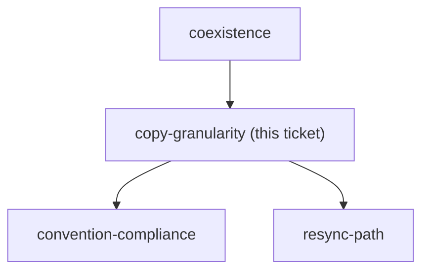

<!-- decision-map:graph:start -->

<!-- decision-map:graph:end -->

## Question

Do we vendor all six affected skill directories wholesale (~2100 lines, including 250-line brainstorming and 568-line subagent-driven-development that are mostly unrelated to review), or copy only the four reviewer prompt files plus thin skills that delegate the rest to superpowers? Weigh the maintenance surface against the coupling each option leaves behind.
