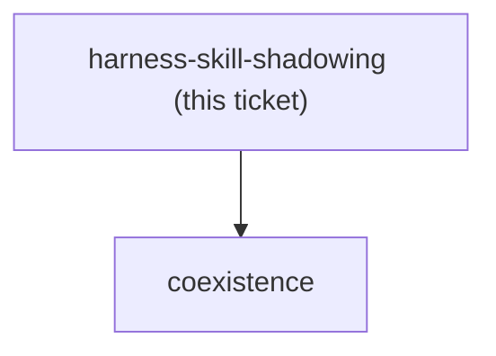
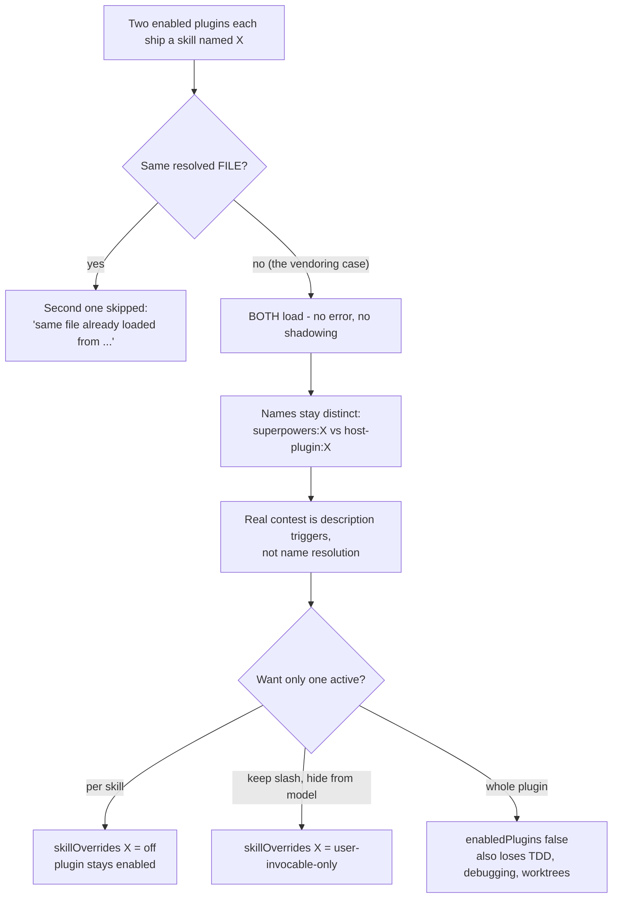

<!-- decision-map:graph:start -->

<!-- decision-map:graph:end -->

## Question

When two enabled plugins each ship a skill with the same name (e.g. superpowers:brainstorming and a vendored copy), how does Claude Code resolve it - both listed, one shadowed, or an error? Can a single skill from an installed plugin be disabled or shadowed without disabling the whole plugin? Evidence from the shipped binary, official docs or plugin schema, not from recollection.

<!-- decision-map:resolution:start -->
## Resolution

Both load - no collision, since plugin skills are namespaced plugin:skill; skillOverrides switches off one skill without disabling its plugin.

# Findings — how Claude Code resolves two skills with the same name from different plugins



Investigated by string-grepping the shipped native binary
`C:/Users/thodsaphon.sonthipin/.local/bin/claude` (319,026,336 bytes, mtime 2026-08-14).
Positive control in the same run: `grep -ac "SKILL\.md"` returned **182** matching lines,
so the grep is genuinely reaching the skill-loading strings — negative results below are
therefore meaningful. (The VS Code `extension.js` was deliberately not used: it is a
wrapper and carries none of these strings.)

## Verdict

**Both skills load. There is no name-collision resolution, because there is no name
collision to resolve** — plugin skills are namespaced `plugin:skill`, so
`superpowers:brainstorming` and `<host>:brainstorming` are two distinct names. The only
dedup in the loader keys on **file identity**, not on name: it drops a skill solely when
the *same resolved file* was already loaded from another source. Two different files that
happen to share a base name are both kept and both listed.

Separately, **a single skill can be turned off without disabling its plugin**, via the
`skillOverrides` settings key — a per-skill map with four states, including `off`, which
hides the skill from the model *and* from the user. Confidence: **high** on both halves;
see Unknowns for the one detail I could not pin down.

## Evidence

**1. Dedup is by same-file, never by name.** The loader body, recovered verbatim:

```js
let M=v.get(O);
if(M!==void 0){ w(`Skipping duplicate skill '${P.name}' from ${P.source} (same file already loaded from ${M})`); continue }
v.set(O,P.source), S.push(P)
...
let A=y.length-S.length; if(A>0) w(`Deduplicated ${A} skills (same file)`);
```

The map `v` is keyed by `O` — the resolved file, not `P.name`. Both log strings say
"same file" explicitly. `grep -ac "duplicate skill"` → 2 lines; `"Duplicate skill"` and
`"Skill name conflict"` → **0** each.

**2. Names are plugin-qualified, so the two copies cannot be ambiguous.** From the
skill-name validator's own error text:

> "Skill names match the skill's directory name (or 'plugin:skill' for plugin-qualified
> skills); rename the skill if its directory name contains these characters."

This matches what the session's own skill list shows (`superpowers:brainstorming`,
`dev-workflows:scrutinize`). `grep -ac "ambiguous"` → 109 lines, but none of the sampled
contexts concerned skill resolution.

**3. Per-skill disable exists — `skillOverrides`.** Schema description, verbatim:

> `skillOverrides` — "Per-skill listing overrides keyed by skill name. `name-only` lists
> the skill without its description; `user-invocable-only` hides it from the model but
> keeps `/name`; `off` hides it from both. Absent = on."

Enum recovered: `["on","name-only","user-invocable-only","off"]`. It sits in the same
settings-key cluster as `env`, `modelOverrides`, `disabledMcpjsonServers`,
`deniedMcpServers` — and appears in more than one of those clusters, which indicates it is
settable at more than one settings level. The runtime enforces it with two distinct
messages:

> `Skill "<name>" is disabled via skillOverrides. Remove the override from your settings to run it.`
> `Skill "<name>" is disabled via skillOverrides. Re-enable it in /skills or remove the override from your settings to run it.`

So there is also an interactive `/skills` surface for the same toggle.

**4. `disableBundledSkills` is the wrong lever for this job** — worth recording so nobody
reaches for it. Verbatim:

> "Disable the skills and workflows that ship with Claude Code: bundled skills and
> workflows are removed entirely; built-in slash commands stay typable but are hidden from
> the model. **Plugins, `.claude/skills/`, and `.claude/commands/` are unaffected.**
> Equivalent to `CLAUDE_CODE_DISABLE_BUNDLED_SKILLS`."

It targets first-party bundled skills only, and explicitly does not touch plugins.

**5. No global per-skill kill-switch under another name.** `disabledSkills`,
`disabled_skills`, `skillsDisabled` → **0** matches each. `skillOverrides` is the
mechanism.

## Unknowns

- **The exact key form `skillOverrides` expects for a plugin skill** — bare
  (`brainstorming`) or qualified (`superpowers:brainstorming`). The schema says "keyed by
  skill name", and the validator says a plugin skill's name *is* `plugin:skill`, which
  makes the qualified form the strong reading — but I did not find a line that shows a
  plugin-qualified key being matched, so treat it as inference. One live check settles it:
  add the override, then look for the skill in the `/skills` list.
- **Precedence between a personal `.claude/skills/<name>` and a plugin skill of the same
  name** — not the case being charted, and no string spoke to it.
- **Whether `/skills` writes to user or project settings** when toggling.
- Official web documentation was not consulted; the binary is the authority actually
  running here, and it answered.

## What this means for the decision

- Keeping `superpowers` enabled alongside vendored copies **will not error and will not
  silently shadow anything** — both sets load, under distinct `plugin:skill` names. The
  real cost is *description-trigger competition* for model auto-invocation, not name
  resolution. That makes the naming ticket a triggering problem, not a collision problem.
- Because the loader dedups only on identical files, **byte-identical vendored copies are
  still two skills** — copying does not make the original disappear by any mechanism.
- `skillOverrides: {"<skill>": "off"}` gives a per-skill retreat, so "disable superpowers
  entirely" is not the only alternative to coexistence: individual upstream review skills
  can be switched off while the rest of superpowers (TDD, systematic-debugging,
  worktrees) keeps working. That directly widens the option set on the coexistence ticket
  and touches the fog line about the non-review superpowers skills.
- `user-invocable-only` is a third position worth weighing: it keeps `/superpowers:x`
  typable while hiding it from the model, so a copy can win auto-invocation without the
  original being lost.

<!-- decision-map:resolution:end -->
