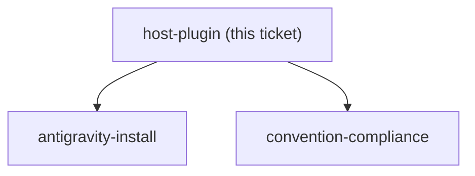

<!-- decision-map:graph:start -->

<!-- decision-map:graph:end -->

## Question

Do the vendored skills land inside plugins/dev-workflows (one plugin, but six large foreign skills mixed into the daily arc) or in a new plugin such as superpowers-local (its own manifest, marketplace entry, version and one-time enable step)? Decide against the repo's existing plugin boundaries, not just file tidiness.
