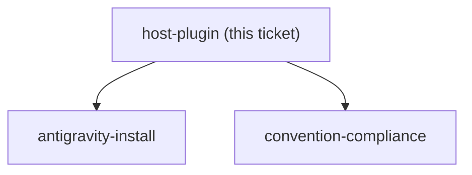
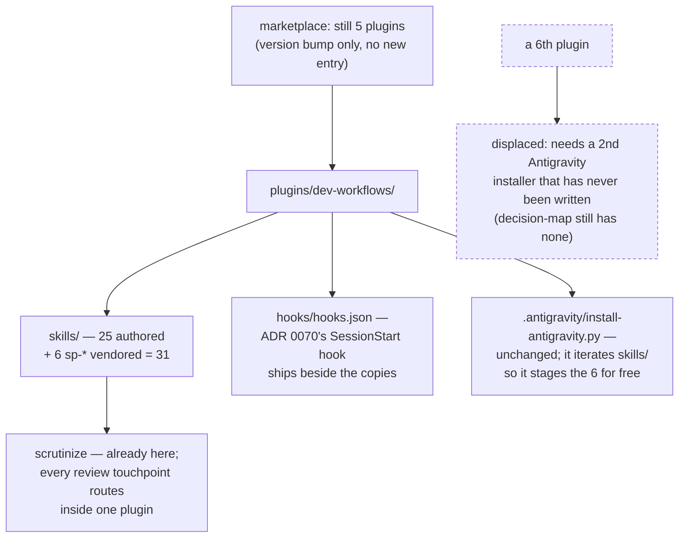

<!-- decision-map:graph:start -->

<!-- decision-map:graph:end -->

## Question

Do the vendored skills land inside plugins/dev-workflows (one plugin, but six large foreign skills mixed into the daily arc) or in a new plugin such as superpowers-local (its own manifest, marketplace entry, version and one-time enable step)? Decide against the repo's existing plugin boundaries, not just file tidiness.

<!-- decision-map:resolution:start -->
## Resolution

The six copies live in plugins/dev-workflows - no sixth plugin: the destination needs Antigravity and its only installer is plugin-local, and ADR 0070's hook must ship beside them.

Detail: docs/adr/0073-vendored-review-skills-live-inside-dev-workflows-not-a-plugin-of-their-own.md

The copies land in `plugins/dev-workflows/skills/`. No sixth plugin; `dev-workflows`
takes a version bump on its existing `marketplace.json` entry.

**What decided it.** The destination requires both harnesses, and Antigravity has
exactly one route in — `plugins/dev-workflows/.antigravity/install-antigravity.py`,
which is plugin-local by construction (`PLUGIN_ROOT` is the parent of its own
`.antigravity/`, shared support hard-coded to `.dev-workflows-shared`) and discovers
skills by iterating `PLUGIN_ROOT/skills`. Inside `dev-workflows` the six are staged with
zero installer changes; in a new plugin they need a second installer — and
`decision-map`, created as the fourth plugin on 2026-07-31, still has no `.antigravity/`
at all. A new plugin has so far meant Claude Code only.

ADR 0070's hook is the second lock: `dev-workflows` is the only plugin here with a
`hooks/` directory, and splitting the hook from the copies lets a colleague enable a
hook that steers at skills they do not have.

**Re-scope during the session.** The grilling opened on a live possibility that
`dev-workflows` was itself being deprecated and folded into a new marketplace, which
would have voided the ticket's whole framing. That was checked before answering — the
repo carries no deprecation record anywhere — and the owner then settled it directly:

> "งั้น dev-workflows ไม่ depecate เก็บไว้ในdev-workflows เลย"

That withdrawal, rather than a deferral, is also why "land it here now and split later"
was rejected instead of kept as a hedge.

**Raised, not settled:** ADR 0072's Step 0 preflight on `sp-writing-plans` can no longer
fail now that `grill-then-plan` ships in the same plugin as its target — it was kept
only because `host-plugin` had not answered. Graduated as its own ticket.

<!-- decision-map:resolution:end -->
