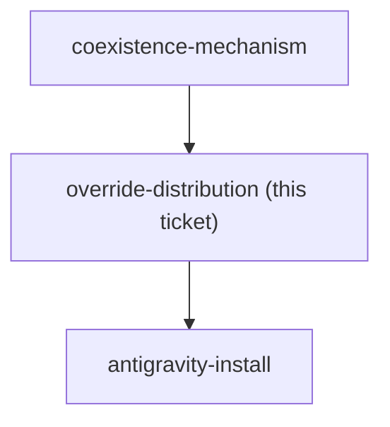

<!-- decision-map:graph:start -->

<!-- decision-map:graph:end -->

## Question

Coexistence chose skillOverrides: off on the six upstream review skills - but a plugin cannot ship a settings key. Overrides live in settings.json, not in the marketplace. So how does a colleague who installs this marketplace end up with the six originals switched off: a committed project .claude/settings.json in every consuming repo, a documented manual step in the README, an install script, or something else? And what is the Antigravity equivalent, given the destination requires the copies to run there too? Without a reliable answer, coexistence degrades to 'change nothing' on every machine except this one, silently.

## Comment

## Premise note (2026-08-14): "the six skillOverrides entries" no longer exist

This ticket's title and question assume the mechanism ADR 0069 chose: six
`skillOverrides` entries that a colleague's machine needs. `skilloverrides-live-check`
has since observed that `skillOverrides` has no effect on any plugin-provided skill
on Claude Code 2.1.232, so there are no six entries to distribute.

Do not answer this ticket as written. It is now blocked on
`coexistence-mechanism`, and what needs distributing depends entirely on which way
that goes:

- **whole plugin off** - one `enabledPlugins` entry per machine, plus whatever the
  Antigravity equivalent is. Distribution gets *simpler*, and it is still a
  settings key that a plugin cannot ship, so this ticket's real question survives.
- **plugin fully on** - nothing to distribute at all. This ticket closes as
  not-applicable, and its risk moves into the trigger-competition question on
  `skill-naming`.

Re-scope the title and question when the mechanism is decided.

