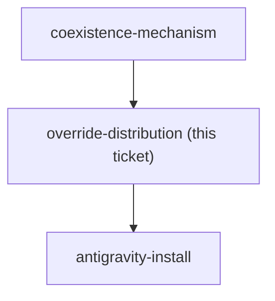
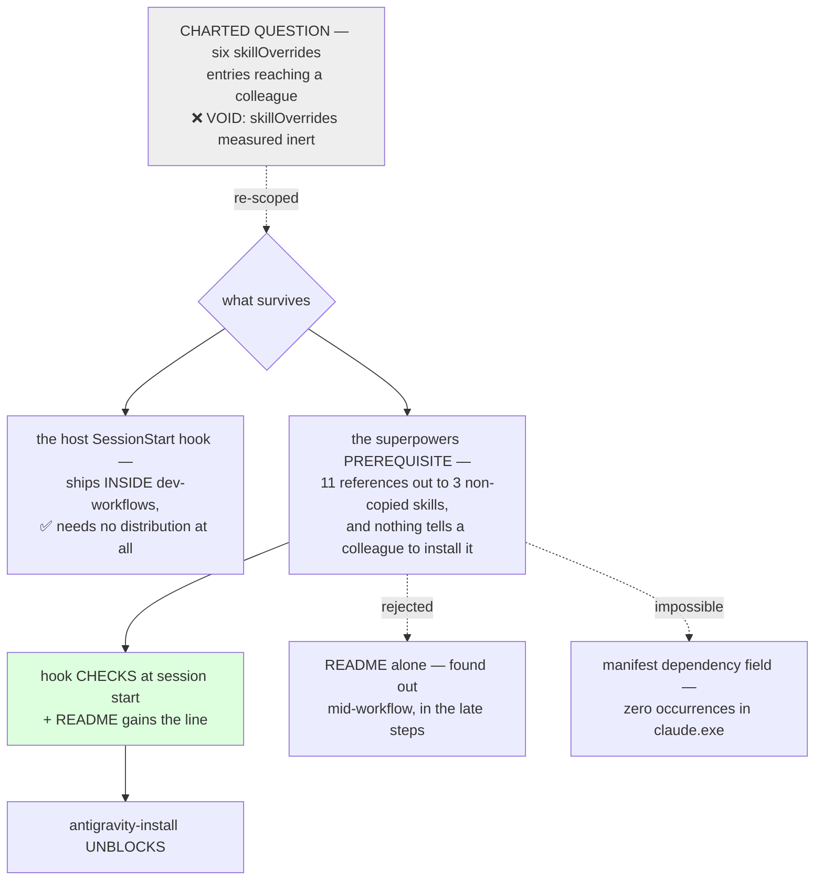

<!-- decision-map:graph:start -->

<!-- decision-map:graph:end -->

## Question

Coexistence chose skillOverrides: off on the six upstream review skills - but a plugin cannot ship a settings key. Overrides live in settings.json, not in the marketplace. So how does a colleague who installs this marketplace end up with the six originals switched off: a committed project .claude/settings.json in every consuming repo, a documented manual step in the README, an install script, or something else? And what is the Antigravity equivalent, given the destination requires the copies to run there too? Without a reliable answer, coexistence degrades to 'change nothing' on every machine except this one, silently.

## Comment

## Premise note (2026-08-14): "the six skillOverrides entries" no longer exist

This ticket's title and question assume the mechanism ADR 0069 chose: six
`skillOverrides` entries that a colleague's machine needs. `skilloverrides-live-check`
has since observed that `skillOverrides` has no effect on any plugin-provided skill
on Claude Code 2.1.232, so there are no six entries to distribute.

Do not answer this ticket as written. It is now blocked on
`coexistence-mechanism`, and what needs distributing depends entirely on which way
that goes:

- **whole plugin off** - one `enabledPlugins` entry per machine, plus whatever the
  Antigravity equivalent is. Distribution gets *simpler*, and it is still a
  settings key that a plugin cannot ship, so this ticket's real question survives.
- **plugin fully on** - nothing to distribute at all. This ticket closes as
  not-applicable, and its risk moves into the trigger-competition question on
  `skill-naming`.

Re-scope the title and question when the mechanism is decided.

## Comment

## This ticket's premise no longer holds (2026-08-14, noted from `skill-naming`)

Not a resolution — a scope note left by a session working a different ticket.

The title asks *"how do the six `skillOverrides` entries reach a colleague's machine?"*
There are no `skillOverrides` entries to distribute. `skilloverrides-live-check`
measured on Claude Code **2.1.232** that `skillOverrides` cannot reach a **plugin**
skill by either key form, and [ADR 0070](../../../adr/0070-host-sessionstart-hook-repoints-the-one-skill-the-upstream-hook-names.md)
replaced that lever with a host SessionStart hook shipped by this marketplace. ADR 0070
states the consequence directly: *"no settings key is required on a colleague's
machine."*

So whoever takes this ticket should expect to **re-scope the question before answering
it**, not answer it as written. The distribution question that survives is a different
one, and it is narrower:

- the host hook ships **inside** this marketplace, so it arrives with the plugin — that
  half needs no distribution mechanism at all;
- what does *not* ship inside any plugin is anything living in a colleague's own
  `~/.claude/`. That is now charted as its own ticket, `user-command-entry`, for the
  three commands (`/brainstorm`, `/write-plan`, `/execute-plan`) that name a
  `superpowers:` skill directly and bypass both the hook and the descriptions.

Two consequences for the frontier, which the taker should confirm rather than assume:

1. `antigravity-install` is blocked on this ticket. If the answer here collapses to
   "nothing to distribute", that blocker releases cheaply.
2. This ticket may be closeable as out-of-scope rather than answered. That is the
   taker's call with the user, not this session's.

Also worth checking against the map's fog list: the line about Claude Code's `/skills`
picker showing an override as applied while enforcement ignores it was written when
`skillOverrides` was still the mechanism. With that lever abandoned, that fog line may
be stale too.

## Comment

## Note — this ticket's premise may no longer exist (not a resolution)

Raised while resolving `host-plugin`; recorded so the next session checks the premise
before grilling the question.

This ticket asks how **six `skillOverrides` entries** reach a colleague's machine. There
are no such entries any more:

- `skilloverrides-live-check` measured that `skillOverrides` cannot reach a **plugin**
  skill by either key form on Claude Code 2.1.232.
- [ADR 0070](../../../adr/0070-host-sessionstart-hook-repoints-the-one-skill-the-upstream-hook-names.md)
  replaced that lever with a host SessionStart hook and states outright that **"no
  settings key is required on a colleague's machine."**
- [ADR 0073](../../../adr/0073-vendored-review-skills-live-inside-dev-workflows-not-a-plugin-of-their-own.md)
  puts that hook in `plugins/dev-workflows/hooks/hooks.json`, so it ships with the plugin
  and needs no per-machine distribution step at all.

So the next session should decide between two outcomes rather than answering as written:

1. **Close it as void / out of scope** — nothing is distributed, because nothing is
   configured per machine.
2. **Re-scope it** to the distribution question that *does* survive: a colleague still
   has to have the upstream `superpowers` plugin installed for the eight non-copied
   skills the copies hand off to, and the host hook only steers if this marketplace is
   installed. That is a prerequisites question, not a `skillOverrides` question.

Either way it currently **blocks `antigravity-install`**, and that edge is probably
spurious now — `host-plugin` resolving already made the installer side automatic
(discovery iterates `PLUGIN_ROOT/skills`), so `antigravity-install`'s remaining question
is only whether the copies introduce a `${CLAUDE_PLUGIN_ROOT}` shape outside
`rewrite_plugin_root()`'s three handles.

## Comment

## Constraint from `short-ref-resolution` — a missing copy fails SILENTLY (2026-08-15)

Not a resolution of this ticket. One thing a distribution answer now has to survive.

Measured on Claude Code 2.1.232, 2/2 runs: when a `sp-` copy is **absent** from a machine,
a short-form reference to it does **not** error. The model launches the nearest live twin
instead — `sp-writing-plans` reached **`superpowers:writing-plans`**, with no error, no
warning, and a normal-looking completion. A bare name with *no* twin is refused cleanly,
so the substitution happens only where a twin exists, which the `sp-` convention
guarantees for all six copies.

This ticket owns how the six `skillOverrides` entries reach a colleague's machine. The
finding widens what "reach" has to mean: **a colleague whose install is partial, stale or
mis-scoped does not get an error — they get the upstream review skill the whole effort
exists to displace, and no signal that it happened.** A distribution mechanism that can
half-land is therefore not merely inconvenient; it reproduces the exact silent failure
[ADR 0069](../../../adr/0069-the-upstream-plugin-stays-enabled-its-review-skills-go-off-per-skill.md)'s
option C was rejected for, by a different route.

Worth answering here, or splitting into its own ticket: **is there anything that makes a
missing copy observable?** The three candidates seen so far are a startup assertion in the
copies' own text, a check in the ADR 0075 resync checker, and accepting the risk on the
grounds that the copies ship inside `dev-workflows` and so cannot go missing separately.
The third is the cheapest and is probably right for Claude Code — but it is exactly the
kind of claim that has been wrong twice on this map, and it does not obviously hold for
the Antigravity install, which stages skill directories one at a time.

Evidence and reproduction:
[`short-ref-resolution`](short-ref-resolution.md).

<!-- decision-map:resolution:start -->
## Resolution

The skillOverrides question is VOID - re-scoped to the prerequisite that survives: the host SessionStart hook checks that superpowers is installed, and the README gains the line.

Detail: docs/adr/0078-the-superpowers-prerequisite-is-checked-by-the-host-hook-not-only-documented.md

Detail is in ADR 0078, linked above. What belongs here is the re-scope, and the three
measurements that turned a void ticket into a real one.

## The re-scope

The charted question is **void**, and three earlier sessions had already said so on this
ticket without being able to act on it. `skillOverrides` is inert against plugin skills,
so there were never six entries to distribute.

It was **re-scoped rather than closed**, because a real question survives underneath and no
other ticket owns it. `user-command-entry` owns `~/.claude/commands/`.
`antigravity-install` owns the installer. Neither owns the prerequisite.

The ticket's `title` was rewritten to the surviving question in the same change, so the
map's index no longer advertises a question this repo has abandoned.

## What was measured before anything was put to the user

1. **Eleven outbound references** from the six copies to three skills that are *not* being
   copied — `finishing-a-development-branch` (7), `using-git-worktrees` (3),
   `using-superpowers` (1). The map's out-of-scope list called two of them load-bearing;
   this is the count.
2. **The README does not mention `superpowers`** — four `/plugin install` lines, none of
   them that one, and four prerequisites, none of them that one.
3. **The harness has no dependency field** — `requiredPlugins` and `peerPlugins` occur
   zero times in `claude.exe`. So the answer could only be documentation or a runtime
   check, which is exactly the two-way choice that was put to the user.

## One correction found while resolving

Earlier comments on this ticket treat ADR 0070's host hook as something that already
ships. It does not exist. At `e7839a8` the plugin's `hooks.json` is `{"hooks": {}}` — the
`PostToolUse` commit-log hook was removed and no `SessionStart` hook was ever added. The
decision recorded here therefore *adds a requirement to a file that must be written
anyway*, which is most of why it is cheap.

That same commit also retires the commit-log hook in the repository, which answers one of
the map's four fog lines — *"whether the commit-log PostToolUse hook (ADR 0054) is being
retired"*. It has been. That fog line was not graduated here, because it belongs to
whoever owns ADR 0054 rather than to this ticket.

## The owner's words

Two options were put, with the recommendation stated first and my own bias declared — I
counted the eleven references, so I am the reader most impressed by them. Option A was the
README line alone; option B was the hook check plus the README line. The user chose:

> **b**

The user also directed that this ticket be worked in a session that had already resolved
one, past the map's one-ticket cap. Their call, recorded because a later reader cannot see
it.

## Facts later tickets can use

- **`antigravity-install` is unblocked** by this resolution and was blocked on it alone.
- The Antigravity half of the prerequisite question is **not** answered here. No hook
  mechanism was established for that harness, and `install-antigravity.py` is still run by
  hand. That is `antigravity-install`'s to settle, alongside the licence-file finding
  already recorded there.
- A missing `superpowers` fails **loudly** — with no upstream twin present, a bare
  reference is refused rather than silently substituted. That is the opposite of the
  missing-copy case measured on
  [`short-ref-resolution`](short-ref-resolution.md), and the difference is what made
  option A defensible rather than negligent.

<!-- decision-map:resolution:end -->
