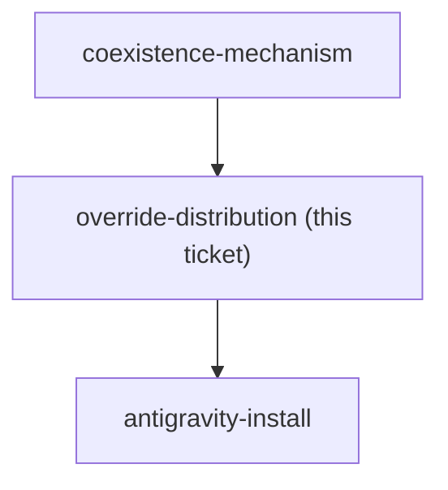

<!-- decision-map:graph:start -->

<!-- decision-map:graph:end -->

## Question

Coexistence chose skillOverrides: off on the six upstream review skills - but a plugin cannot ship a settings key. Overrides live in settings.json, not in the marketplace. So how does a colleague who installs this marketplace end up with the six originals switched off: a committed project .claude/settings.json in every consuming repo, a documented manual step in the README, an install script, or something else? And what is the Antigravity equivalent, given the destination requires the copies to run there too? Without a reliable answer, coexistence degrades to 'change nothing' on every machine except this one, silently.

## Comment

## Premise note (2026-08-14): "the six skillOverrides entries" no longer exist

This ticket's title and question assume the mechanism ADR 0069 chose: six
`skillOverrides` entries that a colleague's machine needs. `skilloverrides-live-check`
has since observed that `skillOverrides` has no effect on any plugin-provided skill
on Claude Code 2.1.232, so there are no six entries to distribute.

Do not answer this ticket as written. It is now blocked on
`coexistence-mechanism`, and what needs distributing depends entirely on which way
that goes:

- **whole plugin off** - one `enabledPlugins` entry per machine, plus whatever the
  Antigravity equivalent is. Distribution gets *simpler*, and it is still a
  settings key that a plugin cannot ship, so this ticket's real question survives.
- **plugin fully on** - nothing to distribute at all. This ticket closes as
  not-applicable, and its risk moves into the trigger-competition question on
  `skill-naming`.

Re-scope the title and question when the mechanism is decided.

## Comment

## This ticket's premise no longer holds (2026-08-14, noted from `skill-naming`)

Not a resolution — a scope note left by a session working a different ticket.

The title asks *"how do the six `skillOverrides` entries reach a colleague's machine?"*
There are no `skillOverrides` entries to distribute. `skilloverrides-live-check`
measured on Claude Code **2.1.232** that `skillOverrides` cannot reach a **plugin**
skill by either key form, and [ADR 0070](../../../adr/0070-host-sessionstart-hook-repoints-the-one-skill-the-upstream-hook-names.md)
replaced that lever with a host SessionStart hook shipped by this marketplace. ADR 0070
states the consequence directly: *"no settings key is required on a colleague's
machine."*

So whoever takes this ticket should expect to **re-scope the question before answering
it**, not answer it as written. The distribution question that survives is a different
one, and it is narrower:

- the host hook ships **inside** this marketplace, so it arrives with the plugin — that
  half needs no distribution mechanism at all;
- what does *not* ship inside any plugin is anything living in a colleague's own
  `~/.claude/`. That is now charted as its own ticket, `user-command-entry`, for the
  three commands (`/brainstorm`, `/write-plan`, `/execute-plan`) that name a
  `superpowers:` skill directly and bypass both the hook and the descriptions.

Two consequences for the frontier, which the taker should confirm rather than assume:

1. `antigravity-install` is blocked on this ticket. If the answer here collapses to
   "nothing to distribute", that blocker releases cheaply.
2. This ticket may be closeable as out-of-scope rather than answered. That is the
   taker's call with the user, not this session's.

Also worth checking against the map's fog list: the line about Claude Code's `/skills`
picker showing an override as applied while enforcement ignores it was written when
`skillOverrides` was still the mechanism. With that lever abandoned, that fog line may
be stale too.

