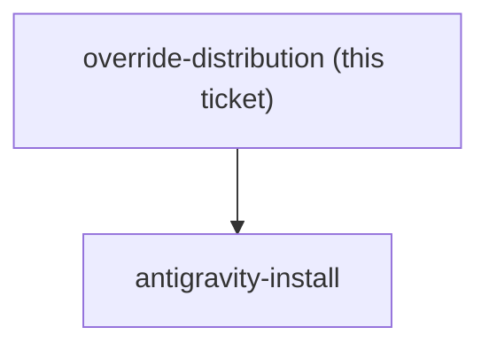

<!-- decision-map:graph:start -->

<!-- decision-map:graph:end -->

## Question

Coexistence chose skillOverrides: off on the six upstream review skills - but a plugin cannot ship a settings key. Overrides live in settings.json, not in the marketplace. So how does a colleague who installs this marketplace end up with the six originals switched off: a committed project .claude/settings.json in every consuming repo, a documented manual step in the README, an install script, or something else? And what is the Antigravity equivalent, given the destination requires the copies to run there too? Without a reliable answer, coexistence degrades to 'change nothing' on every machine except this one, silently.
