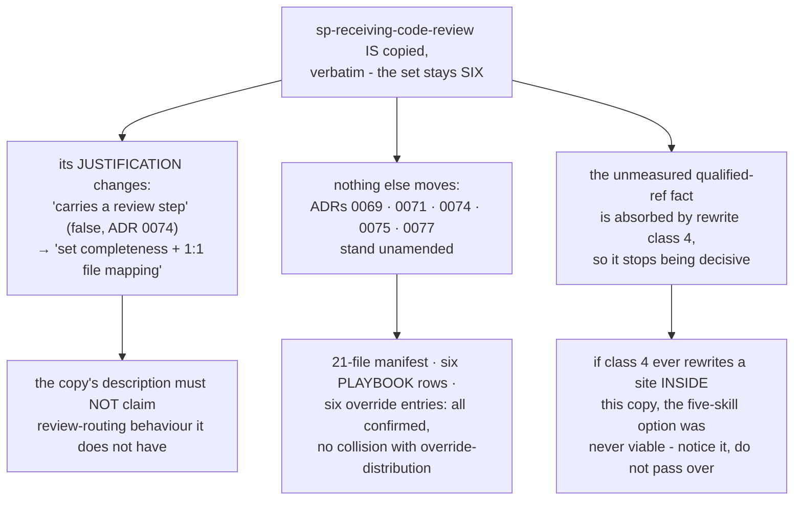

<!-- decision-map:graph:start -->

<!-- decision-map:graph:end -->

## Question

ADR 0074 measured that receiving-code-review dispatches no reviewer at all - it teaches how to TAKE feedback, not how to produce it - and it holds no reviewer prompt file. It is also the one skill of the six with no qualified handoff into another copy, so the chain argument that justifies writing-plans and executing-plans does not apply to it. Does sp-receiving-code-review get edited to expect scrutinize-shaped findings, stay a verbatim copy purely to keep the sp- set complete, or not get copied at all - and if it is not copied, what happens to ADR 0071's six-name set and the description that was to displace the upstream original?

<!-- decision-map:resolution:start -->
## Resolution

Copied verbatim - the set stays six, justified by set completeness and the 1:1 upstream mapping, not a review step; ADR 0076 leaves nothing to retune, class 4 absorbs the unmeasured ref fact.

Detail: docs/adr/0078-sp-receiving-code-review-is-copied-for-set-completeness-not-for-a-review-step.md

## What settled it

Two findings, in order.

**The ticket's middle option was already empty.** It asked whether the copy gets "edited to
expect scrutinize-shaped findings". ADR 0076 has the Reviewer prompt translate
`blocker/major/nit` **back into** upstream's `Critical/Important/Minor`, so a routed review
emits exactly upstream's vocabulary. A skill that teaches a human to receive
`Critical/Important/Minor` is correct unedited. There is nothing to adapt to.

**That left a genuine two-way choice**, and it turned on cost plus one fact nobody has
measured: whether upstream `receiving-code-review/SKILL.md` holds a *qualified* reference to
any of the other five. Copying makes that fact harmless — ADR 0074's rewrite class 4 turns
any such handoff into a short `sp-` name mechanically, so the copy absorbs it if it exists
and finds nothing if it does not. Dropping the skill leaves the same fact load-bearing and
unknown.

## The measurement gap, stated plainly

The superpowers plugin cache is **not present** on the machine this ticket was resolved on
(this repo at `936a229`, `claude/decision-mapping-7307sy`). ADR 0074 measured what
touchpoint #6 *dispatches*, never what it *names*. That check was not run here, and the ADR
records it as untaken rather than implying otherwise.

## Confirmation

Presented as a four-way choice with the measurement gap stated up front. The user selected:

> **Copy it verbatim — set stays six**

The three rejected options were: drop it (set becomes five), retune it for scrutinize-shaped
findings (empty, see above), and copy it with edits pointing back into the `sp-` arc (rests
on the same unmeasured fact).

<!-- decision-map:resolution:end -->
