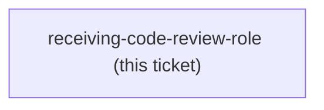

<!-- decision-map:graph:start -->

<!-- decision-map:graph:end -->

## Question

ADR 0074 measured that receiving-code-review dispatches no reviewer at all - it teaches how to TAKE feedback, not how to produce it - and it holds no reviewer prompt file. It is also the one skill of the six with no qualified handoff into another copy, so the chain argument that justifies writing-plans and executing-plans does not apply to it. Does sp-receiving-code-review get edited to expect scrutinize-shaped findings, stay a verbatim copy purely to keep the sp- set complete, or not get copied at all - and if it is not copied, what happens to ADR 0071's six-name set and the description that was to displace the upstream original?
