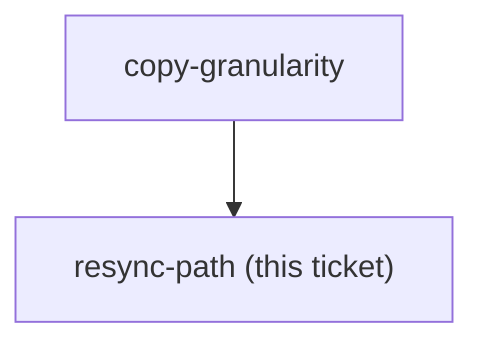

<!-- decision-map:graph:start -->

<!-- decision-map:graph:end -->

## Question

What provenance do the copies record (upstream sha, per-file origin, a manifest?), and what is the written procedure for diffing a newer obra/superpowers against them and re-applying the scrutinize routing? Name where that procedure lives and who runs it.
