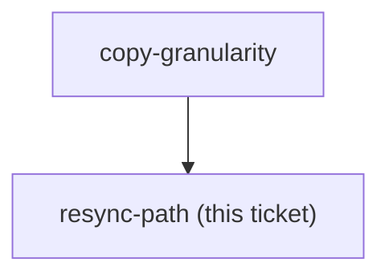

<!-- decision-map:graph:start -->

<!-- decision-map:graph:end -->

## Question

What provenance do the copies record (upstream sha, per-file origin, a manifest?), and what is the written procedure for diffing a newer obra/superpowers against them and re-applying the scrutinize routing? Name where that procedure lives and who runs it.

## Comment

## Two checks this procedure must carry (2026-08-14, from ADR 0070)

`coexistence-mechanism` resolved by keeping the upstream plugin **fully** enabled and
shipping our own SessionStart hook that re-points the one skill their hook names. That
mechanism depends on two properties of the upstream source, and **both can change on a
resync with no error, no warning, and nothing a compile gate can see.** Whatever
procedure this ticket produces has to check them by name:

1. **Does `brainstorming` still hand off by BARE name?** Today it says *"invoke
   writing-plans skill"* and carries no qualified reference at all. That bare name is
   what lets a copy win the handoff. If upstream changes it to
   `superpowers:writing-plans`, the contestable seam becomes a forced one and four more
   originals follow it. Check: `grep -o "superpowers:[a-z-]*" skills/brainstorming/` must
   stay empty.

2. **Do the skills our hook names still exist under those names?** Our hook text names
   the upstream skill it displaces and the copy it prefers. A rename upstream turns our
   hook into a silent no-op - the text still injects, it just refers to nothing. Check
   the two names the upstream hook itself uses:
   `grep -o "superpowers:[a-z-]*" skills/using-superpowers/SKILL.md`, which today returns
   exactly `superpowers:brainstorming` and `superpowers:systematic-debugging`.

A third, cheaper one worth folding in: if that list ever names a **third** skill, the
host hook's coverage is incomplete from that moment on. The count is load-bearing, so
assert on it rather than eyeballing it.

