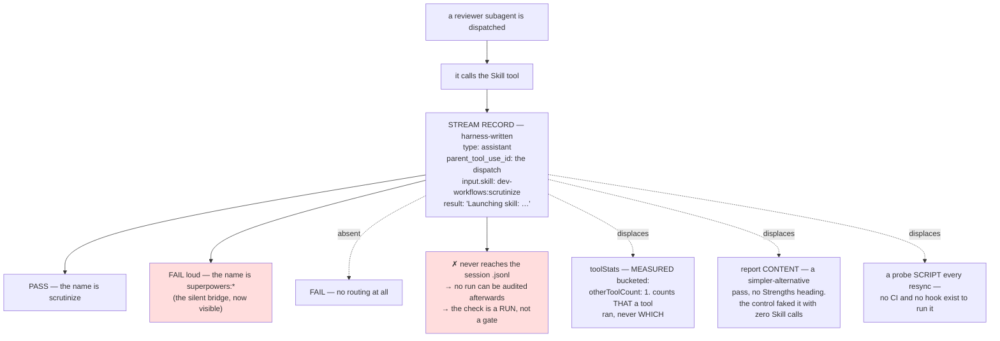

<!-- decision-map:graph:start -->

<!-- decision-map:graph:end -->

## Question

ADR 0076 has the Reviewer prompt translate scrutinize's blocker/major/nit into upstream's Critical/Important/Minor, so a routed review and a built-in review now produce reports in the SAME vocabulary - the labels can no longer tell them apart. What observable signal, on a real end-to-end run, proves the dispatched subagent actually loaded scrutinize rather than falling back to the built-in reviewer? Name the signal, where it is read from, and what makes it impossible to fake by a reviewer that merely produces well-formatted output.

<!-- decision-map:resolution:start -->
## Resolution

The proof is the subagent's own harness-written Skill tool_use naming dev-workflows:scrutinize-dispatch, not a substring of the session log; the check is a run not a gate.

Detail: docs/adr/0084-the-dispatched-reviewer-runs-a-dispatch-tuned-copy-not-the-frozen-scrutinize.md

> **Skill renamed 2026-08-15 by [ADR 0084](../../../adr/0084-the-dispatched-reviewer-runs-a-dispatch-tuned-copy-not-the-frozen-scrutinize.md).**
> ADR 0084 renamed the routed dispatch target from `scrutinize` to `scrutinize-dispatch`.
> The proof mechanism this ticket resolved is unchanged - the subagent's own
> harness-written `Skill` `tool_use` record, not a substring of the session log - only
> the skill name it must name is corrected. **The original resolution is preserved
> unchanged beneath this banner.**

---

## The original resolution, preserved

Full reasoning is in [ADR 0079](../../../adr/0079-routing-proof-is-the-dispatch-streams-skill-record-measured-once.md).
What that ADR does not carry, and this ticket should:

**The two calls the owner made**, each answered by picking the option:

1. **Form — "A recorded one-time measurement + written recipe"** over a runnable probe
   script. The pull toward a script was real and is recorded in the ADR as rejected option
   D: ADR 0075 chose a *checker* over a *checklist* precisely because a silent failure
   outlives a prose instruction. The measurement that settled it against a script here is
   the persistence finding — a script cannot watch real reviews either, because the record
   is gone. It could only ever re-run the same arranged probe, which a recipe does at zero
   maintenance and zero network cost in a repo with nothing to run it on a schedule.
2. **Antigravity — "Record it unobserved, honestly"** over inventing a substitute
   assertion or narrowing the destination. The destination keeps its "both harnesses"
   claim; what is written down is that the *evidence* covers one of them, and why.

**What unlocked the real measurement.** The first probe ran against a stand-in skill
(`dataviz`) because the container's harness listed 31 skills and `scrutinize` was not among
them — reported here, wrongly, as the plugin being unavailable. The owner corrected it in
four words — *"มันอยู่ในโปรเจ็คนี้นี่"* (*"it's in this project"*) — which is what prompted
`claude plugin marketplace add` + `install` against this very checkout, and turned run B
from a generalisation into a measurement of the actual skill, emitting the qualified
`dev-workflows:scrutinize`. Run A survives as the disambiguator rather than being discarded.

**Two things settled without asking, stated so they can be overturned cheaply:** the live
run proves the *mechanism* once while the per-file class-1 wiring stays the static
checker's job (so one probe, not three); and the `blocker`→`Critical` translation is not
this ticket's signal, because ADR 0075 already assigns those three rows to that checker as
a presence assertion.

**The strength that was not asked for.** Because the record names *which* skill rather than
counting a load, `short-ref-resolution` §3's silent bridge — a missing `sp-` name launching
`superpowers:*` with no error — surfaces here as a **wrong name**, which reads as a fail.
That is the one failure on this map that no decision currently guards, and this check sees
it as a side effect of its shape rather than by aiming at it.

**Correction carried from a closed ticket.** `short-ref-resolution` §6 pointed later tickets
at the `Agent` tool's `toolUseResult`, `toolStats` included, for observing subagent
behaviour. It is right about *usage* and wrong about *identity*: `toolStats` is bucketed
(`otherToolCount: 1`), so it cannot name a skill. The correction is commented onto that
ticket; its own findings, including the `effort: max` measurement that rests on `usage`,
are unaffected.

**Left unverified on purpose.** The probe drives a dispatch, not the controller's full fix
loop — it proves the reviewer loaded `scrutinize`, not that a `Critical` finding then fired
the loop at `subagent-driven-development/SKILL.md:356`. And nothing here was run against
the three Reviewer prompts themselves, because the six copies do not exist yet; the recipe
is written to be run when they land.

<!-- decision-map:resolution:end -->

## Discharged by

The recipe this ticket specifies was run at `d385a88` against the six copies, which
now exist. The result -- the observed harness-written `Skill` record naming
`dev-workflows:scrutinize-dispatch`, the two negative controls the probe was seen to
fail, and the Step 3 control recorded honestly as NOT RUN -- is
[the acceptance probe result](../../../superpowers/plans/2026-08-16-acceptance-probe-result.md).
