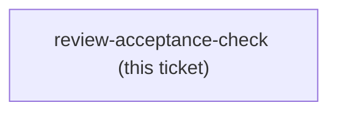

<!-- decision-map:graph:start -->

<!-- decision-map:graph:end -->

## Question

ADR 0076 has the Reviewer prompt translate scrutinize's blocker/major/nit into upstream's Critical/Important/Minor, so a routed review and a built-in review now produce reports in the SAME vocabulary - the labels can no longer tell them apart. What observable signal, on a real end-to-end run, proves the dispatched subagent actually loaded scrutinize rather than falling back to the built-in reviewer? Name the signal, where it is read from, and what makes it impossible to fake by a reviewer that merely produces well-formatted output.
