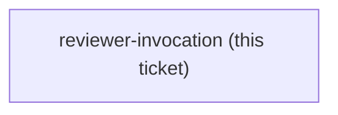
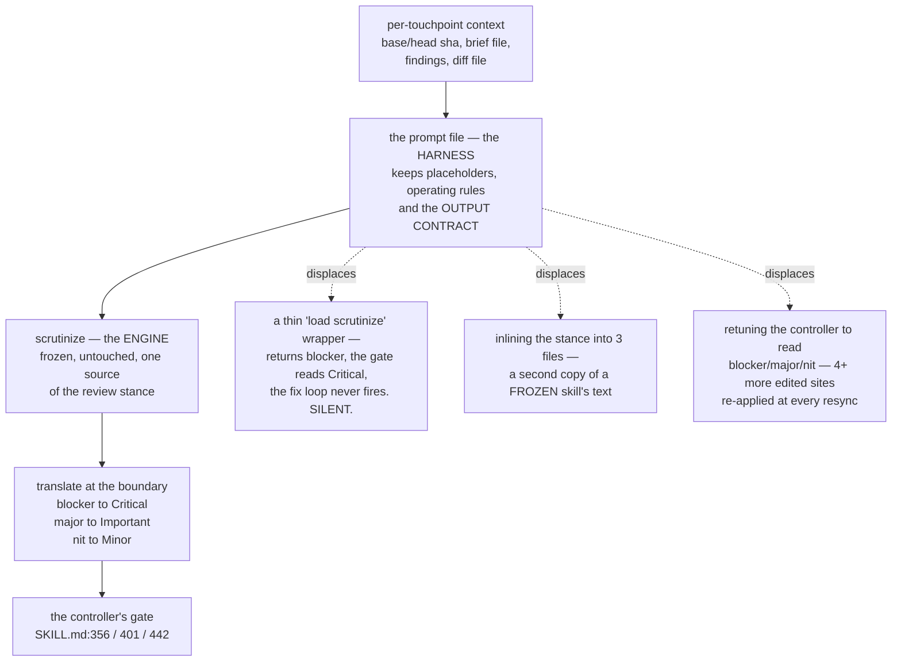

<!-- decision-map:graph:start -->

<!-- decision-map:graph:end -->

## Question

Touchpoints #3, #4 and #5 dispatch a reviewer subagent against a prompt FILE (code-reviewer.md, task-reviewer-prompt.md, re-review-prompt.md), while scrutinize is a human-facing SKILL.md at effort max that is frozen by decision. Does each prompt file become a thin wrapper telling the subagent to load scrutinize, does it inline scrutinize's stance, or something else - and what carries the per-touchpoint context (merge base, plan file, task number) that the prompts supply today?

<!-- decision-map:resolution:start -->
## Resolution

The prompt file stays the HARNESS - context in, output contract out - and delegates only the review method to the frozen scrutinize, translating blocker/major/nit to Critical/Important/Minor.

Detail: docs/adr/0076-reviewer-prompt-is-the-harness-scrutinize-is-the-engine.md

Full reasoning is in [ADR 0076](../../../adr/0076-reviewer-prompt-is-the-harness-scrutinize-is-the-engine.md).
What that ADR does not carry, and this ticket should:

**The measurement that removed the ticket's first option.** `scrutinize` reports
`blocker / major / nit`; the controller gates on `Critical / Important` at
`subagent-driven-development/SKILL.md` **356, 401 and 442**, and ledgers `Minor` at 361
and 364. A prompt that only says *"load `scrutinize` and review this diff"* therefore
matches no gate and the fix loop never fires — no error, no warning. Same silent-failure
class as ADR 0074's shim finding.

**What still carries the per-touchpoint context** — the ticket's second half. Nothing
changes: the prompts keep every placeholder (`[BASE_SHA]`, `[BRIEF_FILE]`,
`[GLOBAL_CONSTRAINTS]`, `[REPORT_FILE]`, `[DIFF_FILE]`, `[FINDINGS]`, …), the operating
rules a dispatched agent needs (read-only checkout, *"You Do Not Dispatch Subagents"*,
*"Do Not Trust the Report"*), and `task-reviewer-prompt.md` keeps its Spec Compliance
part. `scrutinize` addresses none of these — it was written for a human-facing session.

**Owner's constraint, set during this grilling and now in the map notes:** `scrutinize`
is never edited. If a change to it is genuinely required, the change goes into a **new
Skill that is a copy of it**. That option was live here — a dispatch-tuned copy would
delete the translation layer — and was not taken, because the destination routes the
touchpoints to *the existing* `scrutinize`, so a copy would change the destination rather
than resolve a ticket under it.

**Confirmed by the owner in three steps**, each answered `ok`: translate at the boundary
rather than retune the consumer; drop the `Strengths` heading rather than refill it; and
the never-edit-scrutinize rule above, given in their own words —
*"เราจะ[ไม่] mutate scrutinize นะ ถ้าจำเป็นต้องแก้ ให้สร้างสกิลใหม่ ที่ copy มาแก้"*.

**Left unverified on purpose.** `scrutinize` declares `effort: max`. Whether a dispatched
subagent inherits that is unknown and was not assumed; it needs a live check, and
`short-ref-resolution` already owns live checks of this kind.

**New glossary term:** *Reviewer prompt*, added to `CONTEXT.md` — the harness half, named
so later tickets do not call it a skill or a template.

<!-- decision-map:resolution:end -->
