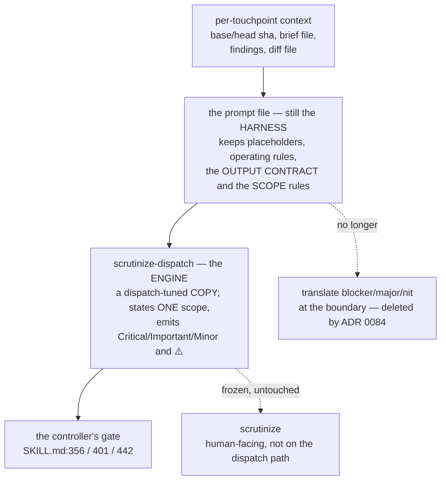

<!-- decision-map:graph:start -->

<!-- decision-map:graph:end -->

## Question

Touchpoints #3, #4 and #5 dispatch a reviewer subagent against a prompt FILE (code-reviewer.md, task-reviewer-prompt.md, re-review-prompt.md), while scrutinize is a human-facing SKILL.md at effort max that is frozen by decision. Does each prompt file become a thin wrapper telling the subagent to load scrutinize, does it inline scrutinize's stance, or something else - and what carries the per-touchpoint context (merge base, plan file, task number) that the prompts supply today?

<!-- decision-map:resolution:start -->
## Resolution

SUPERSEDED by ADR 0084 - harness and frozen scrutinize contradicted each other on scope, so the prompts now name scrutinize-dispatch, a tuned copy; no translation layer.

Detail: docs/adr/0084-the-dispatched-reviewer-runs-a-dispatch-tuned-copy-not-the-frozen-scrutinize.md

> **Superseded 2026-08-15 by [ADR 0084](../../../adr/0084-the-dispatched-reviewer-runs-a-dispatch-tuned-copy-not-the-frozen-scrutinize.md).**
> The answer below stood for one day and was overturned by a `scrutinize` review of this
> map. **The original resolution is preserved unchanged beneath this banner** — its
> measurements are what ADR 0084 builds on.
>
> **What broke it.** ADR 0076 kept the *scoping rules* with the harness while delegating
> the review *method* to `scrutinize`. Those two halves contradict each other in plain
> words, and the ADR states no precedence:
>
> | the harness says | the engine says |
> |---|---|
> | `task-reviewer-prompt.md:40` — *"do not Read a changed file separately"* | *"the diff is the entry point, not the scope"* |
> | `:45` — *"Do not crawl the broader codebase."* | *"Include the unchanged code on either side of the diff."* |
> | `:111` — *"report it as a ⚠️ item instead of broadening your search"* | *"Enumerate every call site"* |
>
> Whichever wins, half the design is silently defeated. If the engine wins, the ⚠️ channel
> empties and the controller's cross-task adjudication at `SKILL.md:345-352` never fires,
> because it has no input. If the harness wins, `scrutinize`'s steps 2 and 3 are disabled
> and only its vocabulary survives — the built-in reviewer wearing new labels, which is
> the exact failure this map exists to remove. ADR 0079's probe cannot separate the two:
> it measures that the reviewer *loaded* the skill, not which stance it then followed.
>
> **What changed.** The owner took the escape hatch recorded below — the one this
> resolution notes "was live here and was not taken". The three prompts now name
> `scrutinize-dispatch`, a copy of `scrutinize` tuned for one caller, differing in exactly
> four places: scope is the task's blast radius, severity is `Critical/Important/Minor`
> natively, the ⚠️ channel is kept, and the verdicts are upstream's. The translation layer
> is deleted rather than asserted. `scrutinize` is now untouched in the stronger sense —
> not edited *and* not on the dispatch path.
>
> **What this costs, recorded rather than argued.** A second stance document now exists
> and can drift. That is the objection ADR 0076 rejected its option C for, reduced from
> three embedded copies to one declared fork with a stated delta, and moved onto the fog
> list — not eliminated.

---

## The original resolution, preserved

Full reasoning is in [ADR 0076](../../../adr/0076-reviewer-prompt-is-the-harness-scrutinize-is-the-engine.md).
What that ADR does not carry, and this ticket should:

**The measurement that removed the ticket's first option.** `scrutinize` reports
`blocker / major / nit`; the controller gates on `Critical / Important` at
`subagent-driven-development/SKILL.md` **356, 401 and 442**, and ledgers `Minor` at 361
and 364. A prompt that only says *"load `scrutinize` and review this diff"* therefore
matches no gate and the fix loop never fires — no error, no warning. Same silent-failure
class as ADR 0074's shim finding. *(This measurement is unaffected by ADR 0084 — it is
why a thin wrapper still cannot work, and why the tuned copy emits the controller's words
natively.)*

**What still carries the per-touchpoint context** — the ticket's second half. Nothing
changes: the prompts keep every placeholder (`[BASE_SHA]`, `[BRIEF_FILE]`,
`[GLOBAL_CONSTRAINTS]`, `[REPORT_FILE]`, `[DIFF_FILE]`, `[FINDINGS]`, …), the operating
rules a dispatched agent needs (read-only checkout, *"You Do Not Dispatch Subagents"*,
*"Do Not Trust the Report"*), and `task-reviewer-prompt.md` keeps its Spec Compliance
part. `scrutinize` addresses none of these — it was written for a human-facing session.
*(Under ADR 0084 the Spec Compliance part and the ⚠️ channel are carried by
`scrutinize-dispatch` itself rather than left as a gap between the two documents.)*

**Owner's constraint, set during this grilling and now in the map notes:** `scrutinize`
is never edited. If a change to it is genuinely required, the change goes into a **new
Skill that is a copy of it**. That option was live here — a dispatch-tuned copy would
delete the translation layer — and was not taken, because the destination routes the
touchpoints to *the existing* `scrutinize`, so a copy would change the destination rather
than resolve a ticket under it. *(ADR 0084 took exactly this option, and changed the
destination line, which is what taking it was defined to mean.)*

**Confirmed by the owner in three steps**, each answered `ok`: translate at the boundary
rather than retune the consumer; drop the `Strengths` heading rather than refill it; and
the never-edit-scrutinize rule above, given in their own words —
*"เราจะ[ไม่] mutate scrutinize นะ ถ้าจำเป็นต้องแก้ ให้สร้างสกิลใหม่ ที่ copy มาแก้"*.

**Left unverified on purpose.** `scrutinize` declares `effort: max`. Whether a dispatched
subagent inherits that is unknown and was not assumed; it needs a live check, and
`short-ref-resolution` already owns live checks of this kind. *(Since verified: it does
inherit — 455/448/391 thinking tokens against a 115/203/170 control, three runs each.)*

**New glossary term:** *Reviewer prompt*, added to `CONTEXT.md` — the harness half, named
so later tickets do not call it a skill or a template.

<!-- decision-map:resolution:end -->
