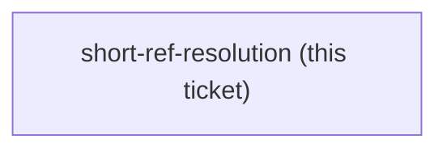
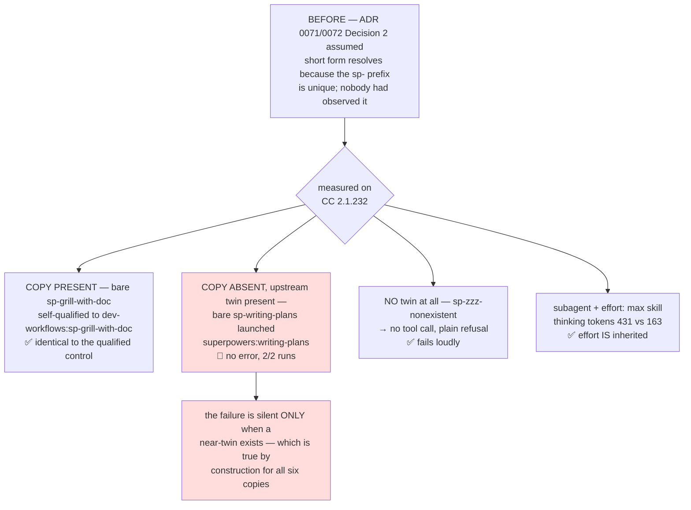

<!-- decision-map:graph:start -->

<!-- decision-map:graph:end -->

## Question

ADR 0071 and ADR 0072 both write every reference to the six copies in short form with no plugin prefix, on the argument that the sp- prefix is unique. That settles AMBIGUITY, not RESOLUTION: on Claude Code a plugin skill is surfaced and invoked as plugin:skill, and nobody has observed whether a bare "load the sp-writing-plans skill" instruction actually reaches it, or whether the model needs the qualified name. On Antigravity skills stage flat, so short form should be exact there - but that is also an assumption. Probe both harnesses the way skilloverrides-live-check did, with a measured run against a control, and record what was observed rather than what was expected. If short form does not resolve on Claude Code, ADR 0071 Decision 2 and ADR 0072 Decision 2 both need amending, and 11 references plus the 6 inside the copies change form.

## Comment

## One more live check for this ticket — does a dispatched subagent keep `effort: max`? (2026-08-14, from `reviewer-invocation`)

[ADR 0076](../../../adr/0076-reviewer-prompt-is-the-harness-scrutinize-is-the-engine.md)
makes the three **Reviewer prompts** dispatch a subagent that loads `scrutinize`.
`scrutinize` declares **`effort: max`** in its frontmatter
(`plugins/dev-workflows/skills/scrutinize/SKILL.md:4`).

Whether a *dispatched subagent* inherits that frontmatter effort is **not known**, and
ADR 0076 deliberately assumed nothing about it. If it does not, every dispatched review
runs the frozen stance at the session's default effort while the ADR's reasoning assumes
the skill's own — a difference in review depth that produces no error and no warning.

This is the same shape as this ticket's existing question, and wants the same treatment:
observe it on a real run rather than reason about it. The probe recipe that has worked
for harness behaviour on this machine is a nested `claude -p` with
`--output-format stream-json --verbose`, reading the per-message `effort` out of
`~/.claude/projects/<slug>/<session-id>.jsonl`, with `env -u CLAUDE_EFFORT` so the
parent's value cannot skew the child.

<!-- decision-map:resolution:start -->
## Resolution

Short form DOES resolve - the model self-qualifies to dev-workflows:sp-*; but with the copy ABSENT it silently launches the upstream twin instead of failing. Subagents DO inherit effort: max.



Both facts were **observed** on Claude Code **2.1.232**, not inferred. Nine `claude -p`
runs, each with a control, `env -u CLAUDE_EFFORT` throughout so the parent's value could
not skew a child.

## 1. The listing carries only the qualified form

The `system/init` event of a `--output-format stream-json --verbose` run reports the
model's actual reach, with no model involvement in the measurement: **211 skills, 254
commands**. Every plugin skill is listed `plugin:skill` and **only** that way —
`dev-workflows:sp-grill-with-doc` is present, the bare `sp-grill-with-doc` is absent.
Non-plugin skills are listed bare (`find-skills`, `handoff`). So the model never sees the
short form in its own listing; short form works, when it works, by the model bridging to
the qualified name itself.

## 2. Short form resolves — Decision 2 stands

The probe used ADR 0071's own mandated sentence verbatim
(`Load the sp-writing-plans skill through your harness's skill mechanism.`), substituting
the one `sp-`-prefixed skill that exists today, `sp-grill-with-doc`:

| run | prompt names | `Skill` tool called with | result |
|---|---|---|---|
| **A** | `sp-grill-with-doc` (bare) | `dev-workflows:sp-grill-with-doc` | launched |
| **B** *(control)* | `dev-workflows:sp-grill-with-doc` | `dev-workflows:sp-grill-with-doc` | launched |

Byte-identical tool calls. **ADR 0071 Decision 2 and ADR 0072 Decision 2 need no
amendment** — the short form does reach the plugin skill, and the uniqueness argument
holds for ambiguity exactly as those ADRs claimed.

## 3. The finding nobody asked for: absence fails SILENTLY

The same sentence naming `sp-writing-plans` — the real name ADR 0072 mandates in all
eleven places, whose copy does not exist yet — did **not** report a missing skill. It
launched **`superpowers:writing-plans`**: the precise upstream skill this whole effort
exists to displace.

| run | prompt names | `Skill` tool called with | error? |
|---|---|---|---|
| **C** | `sp-writing-plans` (absent) | **`superpowers:writing-plans`** | none — `"Launching skill"`, final text `done` |
| **C2** *(repeat)* | `sp-writing-plans` (absent) | **`superpowers:writing-plans`** | none — identical |
| **D** *(disambiguator)* | `sp-zzz-nonexistent` | *(no tool call at all)* | plain refusal: *"isn't in the available skills list"* |

D is what makes C meaningful. The model is not hallucinating blindly — it does semantic
nearest-match, and it refuses cleanly when there is nothing near. The substitution happens
**only when a plausible twin exists**, and the `sp-` convention guarantees that every one
of the six copies has its twin sitting one hop away, live, in the same session. The
failure mode is therefore not a random risk: it is structural, and it is present for
exactly the six skills the effort is about, and for no others.

This is the same *shape* of silent failure that
[ADR 0069](../../../adr/0069-the-upstream-plugin-stays-enabled-its-review-skills-go-off-per-skill.md)'s
option C was rejected for. It is not the same *cause* — that was the hook naming the
originals; this is the model bridging a missing name to the nearest live one — and no
decision on this map currently guards it.

## 4. A dispatched subagent DOES inherit `effort: max`

The recipe the ticket proposed (read per-message `effort` from the session `.jsonl`)
**works for the main loop and cannot reach a subagent**: subagent turns are written to no
session file at all — not the parent's (no `isSidechain` assistant rows), not a sibling
file, and `--output-format stream-json` carries no `effort` field on any message. The
observable that does work is the **Agent tool's own `toolUseResult`**, which records the
subagent's `usage.output_tokens_details.thinking_tokens`.

Two probe skills were built identical but for one line — `effort: max` present or absent —
so the frontmatter field is the only variable:

| cell | thinking tokens, 3 runs | mean |
|---|---|---|
| subagent loads `probe-none` | 115 · 203 · 170 | **163** |
| subagent loads `probe-max` | 455 · 448 · 391 | **431** |

**No overlap** — the lowest `max` run (391) is nearly double the highest `none` run (203).
The main loop was measured directly as a positive control and moves `high` → `max` on the
message *after* the load, for `dev-workflows:scrutinize` and for `probe-max` alike, with
`attributionSkill` set in the same record.

The mechanism agrees. In `claude.exe` the Skill tool returns its effort as a **context
layer to whichever loop invoked it**:

```js
if(b!==void 0)B.push({kind:"effort",effort:b});
return{data:{success:!0,commandName:a,...},newMessages:D,...B.length>0&&{contextLayers:B}}
```

In a dispatched review the subagent is the loop that calls `Skill`, so the layer lands on
the subagent. **[ADR 0076](../../../adr/0076-reviewer-prompt-is-the-harness-scrutinize-is-the-engine.md)
is safe as written** — the three Reviewer prompts dispatch a subagent that loads
`scrutinize`, and that subagent really does run at the skill's own `effort: max`. The ADR
deliberately assumed nothing here; it did not need to.

## 5. Antigravity — premise confirmed, behaviour not observed

Antigravity is installed on this machine but ships **no CLI**, so its skill resolution
cannot be driven headlessly the way `claude -p` can. What *is* checkable is the premise,
and it holds: `install-antigravity.py` stages skills **flat**, one directory per skill
into a single target, with no namespace of any kind —

```python
"${CLAUDE_PLUGIN_ROOT}/skills/": f"{dest_fwd}/",   # skills are staged flat
```

so on Antigravity the bare `sp-writing-plans` *is* the directory name and there is no
qualified form to get wrong. The model-behaviour half is **unobserved** and stays that
way: nothing is staged there today (`~/.gemini/config/skills` does not exist), and the six
copies do not exist to stage. Re-run this check once the copies land and one install has
been done — the risk it would catch is section 3's, which is if anything sharper on a
harness whose tree carries its own separate superpowers copies.

## 6. Facts later tickets can use

- **`discover_skills()` reads `PLUGIN_ROOT / "skills"` and nothing else.** The installer
  stages only `skills/`; no file at the plugin root travels to Antigravity. That answers
  the sub-question left on `antigravity-install` by the `attribution` ticket:
  **`LICENSE-superpowers` would not be carried across** as the installer stands.
- **`--setting-sources project` is a probe-methodology trap.** It hides every plugin skill
  from the child (`dev-workflows:scrutinize` came back *"doesn't exist"*) **and** suppresses
  the effort context layer for a project skill that would otherwise apply it. It silently
  corrupted the first run of the effort experiment here. Do not pass it to a harness probe;
  use `--permission-mode acceptEdits` alone.
- The `Agent` tool's `toolUseResult` is the only place a subagent's usage is recorded —
  `agentId`, `resolvedModel`, `totalTokens`, `totalDurationMs`, `toolStats` and
  per-iteration thinking tokens. Reach for it whenever a future ticket needs to observe
  subagent behaviour.

## Reproduction

```bash
# short-form resolution — read the Skill tool_use input out of the stream
env -u CLAUDE_EFFORT claude -p "Load the sp-writing-plans skill through your harness's skill mechanism. Then stop immediately and reply with the single word: done." \
  --permission-mode acceptEdits --output-format stream-json --verbose > C.log

# subagent effort — read toolUseResult.usage.output_tokens_details.thinking_tokens
#   from ~/.claude/projects/<slug>/<session-id>.jsonl, with two probe skills
#   identical but for the `effort: max` frontmatter line
```

<!-- decision-map:resolution:end -->
