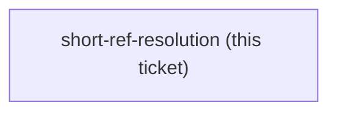

<!-- decision-map:graph:start -->

<!-- decision-map:graph:end -->

## Question

ADR 0071 and ADR 0072 both write every reference to the six copies in short form with no plugin prefix, on the argument that the sp- prefix is unique. That settles AMBIGUITY, not RESOLUTION: on Claude Code a plugin skill is surfaced and invoked as plugin:skill, and nobody has observed whether a bare "load the sp-writing-plans skill" instruction actually reaches it, or whether the model needs the qualified name. On Antigravity skills stage flat, so short form should be exact there - but that is also an assumption. Probe both harnesses the way skilloverrides-live-check did, with a measured run against a control, and record what was observed rather than what was expected. If short form does not resolve on Claude Code, ADR 0071 Decision 2 and ADR 0072 Decision 2 both need amending, and 11 references plus the 6 inside the copies change form.

## Comment

## One more live check for this ticket — does a dispatched subagent keep `effort: max`? (2026-08-14, from `reviewer-invocation`)

[ADR 0076](../../../adr/0076-reviewer-prompt-is-the-harness-scrutinize-is-the-engine.md)
makes the three **Reviewer prompts** dispatch a subagent that loads `scrutinize`.
`scrutinize` declares **`effort: max`** in its frontmatter
(`plugins/dev-workflows/skills/scrutinize/SKILL.md:4`).

Whether a *dispatched subagent* inherits that frontmatter effort is **not known**, and
ADR 0076 deliberately assumed nothing about it. If it does not, every dispatched review
runs the frozen stance at the session's default effort while the ADR's reasoning assumes
the skill's own — a difference in review depth that produces no error and no warning.

This is the same shape as this ticket's existing question, and wants the same treatment:
observe it on a real run rather than reason about it. The probe recipe that has worked
for harness behaviour on this machine is a nested `claude -p` with
`--output-format stream-json --verbose`, reading the per-message `effort` out of
`~/.claude/projects/<slug>/<session-id>.jsonl`, with `env -u CLAUDE_EFFORT` so the
parent's value cannot skew the child.

