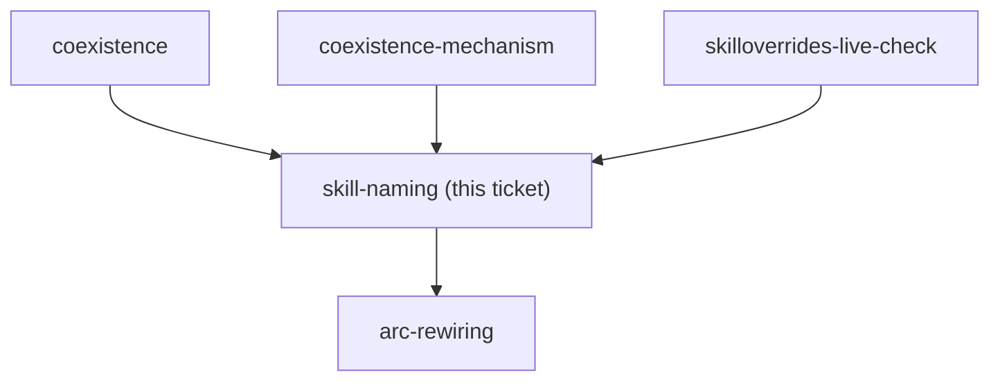

<!-- decision-map:graph:start -->

<!-- decision-map:graph:end -->

## Question

Do the copies keep the upstream skill names (brainstorming, writing-plans, requesting-code-review...) or take distinguishing names, and how are their description triggers written so the intended copy wins and the reference in a sibling skill stays unambiguous?
