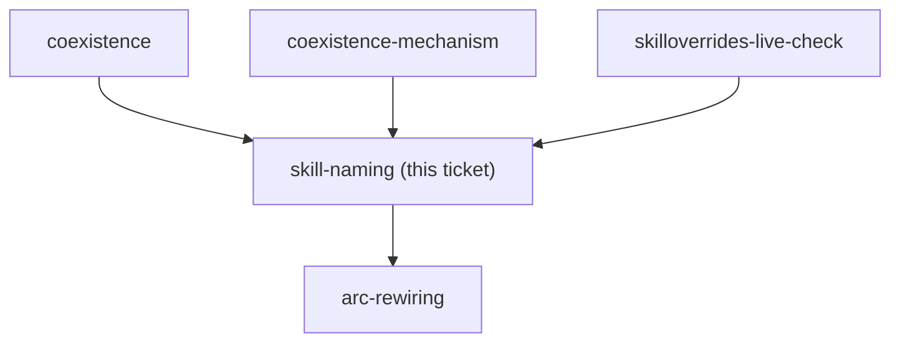
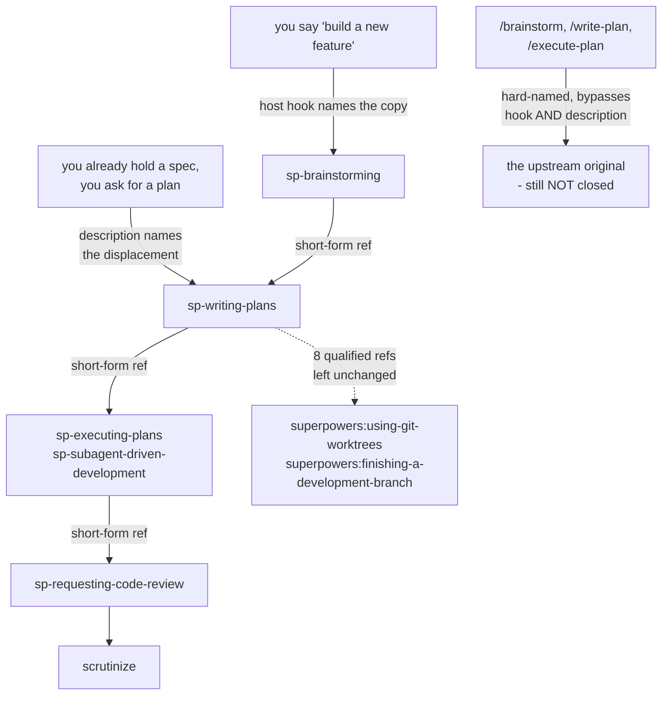

<!-- decision-map:graph:start -->

<!-- decision-map:graph:end -->

## Question

Do the copies keep the upstream skill names (brainstorming, writing-plans, requesting-code-review...) or take distinguishing names, and how are their description triggers written so the intended copy wins and the reference in a sibling skill stays unambiguous?

## Comment

## Unblocked, and the answer now has two consumers (2026-08-14, from ADR 0070)

`coexistence-mechanism` is resolved: the upstream plugin stays **fully** enabled, and
this marketplace ships its own SessionStart hook that re-points the one skill the
upstream hook names. Two consequences land directly on this ticket.

**1. Identical names are off the table.** The originals stay live, all 14 of them, under
their `superpowers:` prefix. So the copies need names that are distinct *and* that win on
description. Note what the naming contest actually is now, because it is narrower than
"six skills competing with six skills":

- The upstream hook forces `superpowers:brainstorming` for build-a-feature requests. Our
  hook displaces exactly that one. So the copy of `brainstorming` wins by **hook text**,
  not by description.
- `brainstorming` then hands off by **bare** name - *"invoke writing-plans skill"*. This
  is the one seam decided purely by the skill list and the descriptions in it. The copy of
  `writing-plans` has to win **here**, and if it does, `executing-plans`,
  `subagent-driven-development` and `requesting-code-review` follow it by qualified
  reference inside the copies. One seam carries four skills.
- `receiving-code-review` is referenced by no other skill in the set. Its copy competes on
  description alone, against an original that also competes on description alone.

So the naming work is not uniform: one skill is won by the hook, one seam is the whole
ballgame, and one skill is a straight description contest.

**2. The host hook's text names the copies, so this ticket's answer feeds it.** The hook
wording cannot be written before the names are fixed, and a later rename silently turns
the hook into a no-op. Whatever names this ticket picks, the hook text and `resync-path`
both have to be updated in the same change.

One measured constraint from ADR 0070 that should shape the descriptions: our hook won
even though its text landed **first** in the merged attachment, ahead of the upstream
text. The win came from specificity, not from position. Descriptions should be written to
win the same way - name the situation more precisely than the original does, rather than
relying on any ordering.

<!-- decision-map:resolution:start -->
## Resolution

The six copies take the sp- prefix, reference each other by short name (the eight non-copied stay superpowers:*), and each description names the upstream skill it displaces.

Detail: docs/adr/0071-vendored-review-skills-take-the-sp-prefix-and-displace-upstream-by-description.md

Canonical reasoning is [ADR 0071](../../../adr/0071-vendored-review-skills-take-the-sp-prefix-and-displace-upstream-by-description.md).
Recorded here: the confirming exchange, and the three findings the grilling turned up
that the ticket's own comment did not have.

## What the user approved

Three questions, three answers, in order:

- naming scheme — **"a"** (the `sp-` prefix, over identical names and arc-native names)
- reference form — **"yes"** (the short form, plus the rule that references to the
  eight non-copied skills stay unchanged)
- description shape — **"c"** (match upstream's situation, then name the displacement
  outright)

## Three findings from the grilling

**1. The ticket's "one seam is the whole ballgame" framing was half right.** The bare
handoff is real and heavier than recorded — `brainstorming/SKILL.md` mentions
`writing-plans` **7** times on superpowers 6.3.0, and **0** of them are qualified. But
when the hook wins, it is *our* copy of `brainstorming` that runs, and that copy's
handoff text is ours to write. The bare reference is only a contest on the fallback
path where the hook loses. That is what made a distinct name affordable.

**2. The Antigravity installer decided the reference form, not preference.**
`install-antigravity.py` maps `${CLAUDE_PLUGIN_ROOT}/skills/` to `<dest>/` — skills are
staged flat, so no plugin namespace exists in the second harness, and the installer
rewrites file paths only. A long-form `plugin:skill` reference is inert there. This also
decouples the ticket from `host-plugin`: a short name carries no plugin, so the copies
can be written before that ticket resolves.

**3. A third entry path exists that neither this ticket nor ADR 0070 accounted for.**
`~/.claude/commands/brainstorm.md`, `write-plan.md` and `execute-plan.md` each name a
`superpowers:` skill directly, and all three name skills on the copy list. A command
bypasses the hook and the description together, so touchpoints #1 and #2 are still lost
whenever one is typed. Out of this ticket's question; graduated as its own ticket.

## The two checks this answer makes runnable

Neither is visible to a compile gate, and both are one command:

- a search for `superpowers:` inside the copies must return only names from the group of
  eight (expected: 8 hits — `finishing-a-development-branch` ×5,
  `using-git-worktrees` ×3);
- a search for any of the six upstream short names, unprefixed, must return nothing.

Counts measured on superpowers **6.3.0** (`b36e0829c6d0`) with this repo at **`7badbd2`**;
they describe those refs, not the trunk forever.

<!-- decision-map:resolution:end -->
