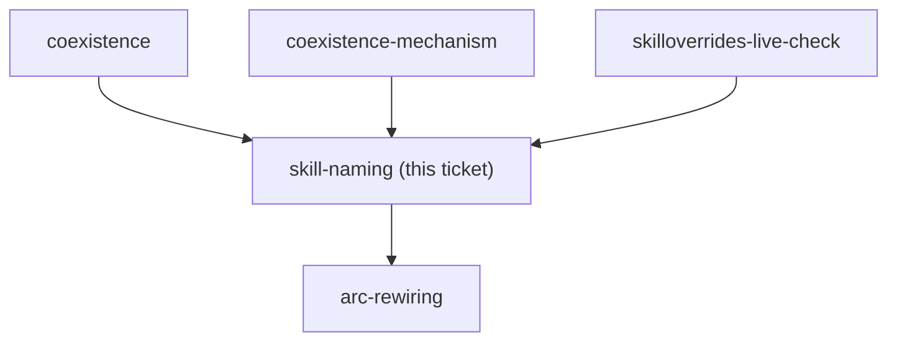

<!-- decision-map:graph:start -->

<!-- decision-map:graph:end -->

## Question

Do the copies keep the upstream skill names (brainstorming, writing-plans, requesting-code-review...) or take distinguishing names, and how are their description triggers written so the intended copy wins and the reference in a sibling skill stays unambiguous?

## Comment

## Unblocked, and the answer now has two consumers (2026-08-14, from ADR 0070)

`coexistence-mechanism` is resolved: the upstream plugin stays **fully** enabled, and
this marketplace ships its own SessionStart hook that re-points the one skill the
upstream hook names. Two consequences land directly on this ticket.

**1. Identical names are off the table.** The originals stay live, all 14 of them, under
their `superpowers:` prefix. So the copies need names that are distinct *and* that win on
description. Note what the naming contest actually is now, because it is narrower than
"six skills competing with six skills":

- The upstream hook forces `superpowers:brainstorming` for build-a-feature requests. Our
  hook displaces exactly that one. So the copy of `brainstorming` wins by **hook text**,
  not by description.
- `brainstorming` then hands off by **bare** name - *"invoke writing-plans skill"*. This
  is the one seam decided purely by the skill list and the descriptions in it. The copy of
  `writing-plans` has to win **here**, and if it does, `executing-plans`,
  `subagent-driven-development` and `requesting-code-review` follow it by qualified
  reference inside the copies. One seam carries four skills.
- `receiving-code-review` is referenced by no other skill in the set. Its copy competes on
  description alone, against an original that also competes on description alone.

So the naming work is not uniform: one skill is won by the hook, one seam is the whole
ballgame, and one skill is a straight description contest.

**2. The host hook's text names the copies, so this ticket's answer feeds it.** The hook
wording cannot be written before the names are fixed, and a later rename silently turns
the hook into a no-op. Whatever names this ticket picks, the hook text and `resync-path`
both have to be updated in the same change.

One measured constraint from ADR 0070 that should shape the descriptions: our hook won
even though its text landed **first** in the merged attachment, ahead of the upstream
text. The win came from specificity, not from position. Descriptions should be written to
win the same way - name the situation more precisely than the original does, rather than
relying on any ordering.

